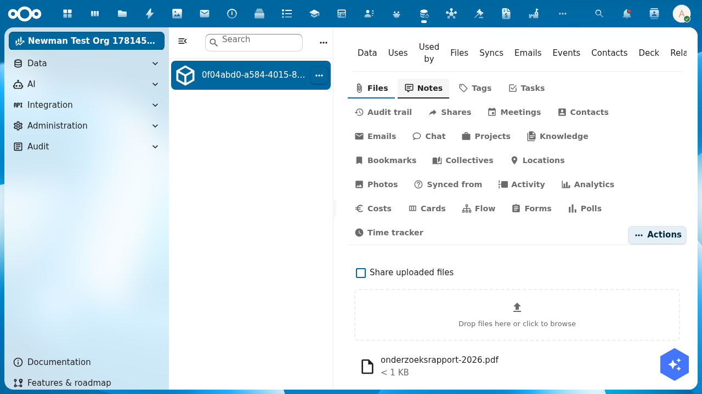

import {Outcomes, Outcome, Prerequisites, PrerequisiteItem, Troubleshooting, TroubleshootingItem, NextSteps, NextStep, ContactCta} from '@conduction/docusaurus-preset/components';

A Woo publication without files is metadata without evidence. In this tutorial you attach documents to a publication through the OpenRegister interface, choose which ones are public, and remove them again. An appendix covers the API, for scripts and for files too large for a browser upload.

{/* truncate */}

<Outcomes title="What you'll learn">
  <Outcome>How to upload one or more files to a publication through the interface.</Outcome>
  <Outcome>How to publish a file, so it gets a public link, and unpublish it again.</Outcome>
  <Outcome>How to list, download, and delete files on a publication.</Outcome>
  <Outcome>How to upload via the API for automation and for large files.</Outcome>
</Outcomes>

<Prerequisites title="What you need">
  <PrerequisiteItem>
    A working Woo register with at least one publication. Follow <a href="/academy/woo-set-up-register">Set up Woo and DCAT registers</a> first.
  </PrerequisiteItem>
  <PrerequisiteItem>A user with rights to edit objects in the register.</PrerequisiteItem>
  <PrerequisiteItem>A few test documents to upload, for example a PDF.</PrerequisiteItem>
</Prerequisites>

## Where files live

Every file is attached to a specific object. OpenRegister keeps the files of an object together in a folder under `Open Registers/{Register Title}/{Object UUID}/` in Nextcloud Files. You do not manage that folder yourself; the interface does it for you.

## Step 1: Open the publication

In OpenRegister, go to **Data → Registers**, open your Woo register and the `onderzoeksrapporten` schema, and click the publication you created in Part 1 to open it. The object's **Files** panel lists the documents attached to this publication. It is empty for a new object.

## Step 2: Upload a file

In the Files panel, drop a file onto the **Drop files here or click to browse** area, or click it to pick a document, for example `onderzoeksrapport-2026.pdf`. The file uploads and appears in the list with its name and size.



To attach more than one document, drop several files at once. Each one gets its own row.

## Step 3: Choose what is public

The **Share uploaded files** toggle decides whether files become public the moment you upload them. Turn it on for documents that may be released right away. Leave it off for attachments that need redaction first, then publish them later.

Each file row has an **Actions** menu to **Open** the file or **Delete** it. To publish or unpublish a file after upload, use the files API in the appendix: publishing gives the file a public share link, unpublishing revokes it.

## Step 4: List, download, and remove

The **Files** tab is also where you manage what is there:

- **Download** a file from its **Actions** menu, or open its public link once published.
- **Delete** a file from the same menu. It is removed from the object folder.

Everything you do here is reflected in Nextcloud Files under the object's folder, and the other way around.

## Appendix: upload via the API

For automation (scripts, synchronisations, CI) and for files too large for a browser upload, OpenRegister exposes a files API. Files always attach to one object:

```
POST /index.php/apps/openregister/api/objects/{register}/{schema}/{id}/files
```

In the examples: host `http://localhost:8080`, auth `admin:admin`, register `woo`, schema `onderzoeksrapporten`, and an object UUID you replace with your own.

### One file via JSON and base64

For small documents you generate in a script:

```bash
OBJ=your-object-uuid
B64=$(echo "Report content." | base64 -w0)

curl -u admin:admin \
  -X POST "http://localhost:8080/index.php/apps/openregister/api/objects/woo/onderzoeksrapporten/$OBJ/files" \
  -H "OCS-APIRequest: true" -H "Content-Type: application/json" \
  -d "{ \"name\": \"rapport-2026.txt\", \"content\": \"$B64\", \"share\": true }"
```

`share: true` creates a public link right away. Base64 inflates the payload by a third, so keep this for small files.

### One or more binary files via multipart

For PDFs, DOCX, and images, `filesMultipart` avoids the base64 overhead and accepts several files in one request:

```bash
curl -u admin:admin \
  -X POST "http://localhost:8080/index.php/apps/openregister/api/objects/woo/onderzoeksrapporten/$OBJ/filesMultipart" \
  -H "OCS-APIRequest: true" \
  -F "files[]=@/path/to/attachment-1.pdf" \
  -F "files[]=@/path/to/attachment-2.pdf" \
  -F "share=true"
```

The total of all files in one request must stay under PHP's `post_max_size` (usually 100 MB).

### Large files in chunks via WebDAV

For files above the upload limit, use Nextcloud's chunked upload protocol, the same one the desktop app uses. Create a transfer folder, send the file in chunks, then assemble it into the object folder:

```bash
TRANSFER_ID="woo-chunked-$(date +%s)"
DAV="http://localhost:8080/remote.php/dav"

curl -u admin:admin -X MKCOL "$DAV/uploads/admin/$TRANSFER_ID"
split -b 10M /path/to/large-report.pdf /tmp/chunk-
i=1; for c in /tmp/chunk-*; do
  curl -u admin:admin -X PUT --data-binary "@$c" \
    "$DAV/uploads/admin/$TRANSFER_ID/$(printf %05d $i)"; i=$((i+1)); done

DEST="$DAV/files/admin/Open%20Registers/Woo/$OBJ/large-report.pdf"
curl -u admin:admin -X MOVE "$DAV/uploads/admin/$TRANSFER_ID/.file" \
  -H "Destination: $DEST" \
  -H "OC-Total-Length: $(wc -c < /path/to/large-report.pdf)"
```

OpenRegister picks the file up automatically once it lands in the object folder. Chunks must go to the uploading user's folder; for a service account, upload as that account.

### Publish and manage via the API

| Action | Method | URL |
| --- | --- | --- |
| Publish a file | `POST` | `/api/objects/{register}/{schema}/{id}/files/{fileId}/publish` |
| Unpublish a file | `POST` | `/api/objects/{register}/{schema}/{id}/files/{fileId}/depublish` |
| List files | `GET` | `/api/objects/{register}/{schema}/{id}/files` |
| Download all as zip | `GET` | `/api/objects/{register}/{schema}/{id}/files/download` |
| Delete a file | `DELETE` | `/api/objects/{register}/{schema}/{id}/files/{fileId}` |

<Troubleshooting title="Troubleshooting">
  <TroubleshootingItem symptom="The upload fails with 'file exceeds upload_max_filesize'">
    The file is larger than PHP allows for a direct upload. Raise <code>upload_max_filesize</code> and <code>post_max_size</code> in <code>php.ini</code>, or use the chunked upload in the appendix.
  </TroubleshootingItem>
  <TroubleshootingItem symptom="A file uploaded via the API does not appear after a MOVE">
    Check that the <code>Destination</code> points to <code>{'Open Registers/{Register Title}/{Object UUID}/'}</code> and that the UUID matches an existing object. OpenRegister scans only that folder.
  </TroubleshootingItem>
  <TroubleshootingItem symptom="A published file gets no public link">
    Check that share links are enabled under Settings → Sharing → "Allow apps to use the share API". Without it, publications cannot get a public link.
  </TroubleshootingItem>
</Troubleshooting>

<NextSteps title="Next step" lede="Your publication now has documents. A few logical next steps:">
  <NextStep
    href="/academy/woo-publish-and-harvest-catalog"
    title="Part 3: Publish and harvest a Woo catalog"
    cta="Continue the series"
  >
    Make your publications public and expose them as a DCAT-AP-NL feed.
  </NextStep>
  <NextStep
    href="https://codeberg.org/Conduction/docudesk"
    title="Redact documents"
    cta="View DocuDesk"
  >
    Automatically redact documents on privacy-sensitive passages before you publish.
  </NextStep>
</NextSteps>

<ContactCta
  title="Want to know more?"
  body="Send us an email. We help you set up your own Woo publication flow in half a day, from first import to public share links."
  cta={{ label: "Email us", href: "mailto:info@conduction.nl?subject=Woo-publicaties" }}
/>
