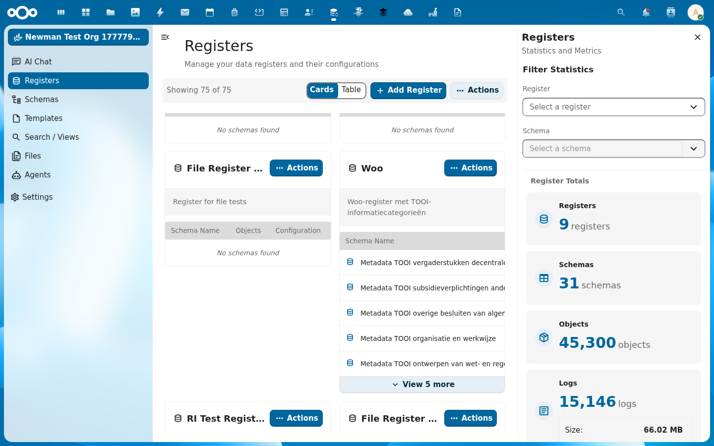

import {Outcomes, Outcome, Prerequisites, PrerequisiteItem, Troubleshooting, TroubleshootingItem, NextSteps, NextStep, ContactCta} from '@conduction/docusaurus-preset/components';

A Woo publication without files is metadata without evidence. In this tutorial you attach documents to a Woo publication through four upload modes: one file, multiple files at once, and large files in chunks. Plus publish, unpublish, and clean up.

{/* truncate */}

<Outcomes title="What you'll learn">
  <Outcome>Four upload modes for documents on a Woo publication, from small to large.</Outcome>
  <Outcome>When to use JSON+base64, multipart, or WebDAV chunked upload.</Outcome>
  <Outcome>How to publish, unpublish, and clean up files.</Outcome>
</Outcomes>

<Prerequisites title="What you need">
  <PrerequisiteItem>
    A working Woo register. Follow <a href="/academy/woo-register-opzetten">Set up a Woo register</a> first if you do not have one yet.
  </PrerequisiteItem>
  <PrerequisiteItem>A publication object with a known UUID.</PrerequisiteItem>
  <PrerequisiteItem><code>curl</code>, basic auth, and a few test files.</PrerequisiteItem>
</Prerequisites>

In the examples we use:

- Host: `http://localhost:8080`
- Auth: `admin:admin`
- Register slug: `woo`
- Schema slug: `onderzoeksrapporten`
- Object UUID: `3422e6cd-1ba5-478c-b842-8f206f9d7358`

Replace the object UUID with your own.



## The base pattern

All files are attached to a specific object. The URL always follows the same pattern:

```
POST /index.php/apps/openregister/api/objects/{register}/{schema}/{id}/files
```

OpenRegister automatically creates a folder for the object under `Open Registers/{Register Title}/{Object UUID}/`. All files land there. The folder appears as soon as you upload the first file.

## Mode 1: one file via JSON and base64

The simplest route, fine for small documents up to a few megabytes:

```bash
OBJ=3422e6cd-1ba5-478c-b842-8f206f9d7358
B64=$(echo "Report content." | base64 -w0)

curl -u admin:admin \
  -X POST "http://localhost:8080/index.php/apps/openregister/api/objects/woo/onderzoeksrapporten/$OBJ/files" \
  -H "OCS-APIRequest: true" \
  -H "Content-Type: application/json" \
  -d "{
    \"name\": \"rapport-2026.txt\",
    \"content\": \"$B64\",
    \"share\": true
  }"
```

The response:

```json
{
  "id": 3306,
  "path": "/admin/files/Open Registers/Woo Register/3422e6cd-.../rapport-2026.txt",
  "title": "rapport-2026.txt",
  "accessUrl": "http://localhost:8080/index.php/s/CH5JsTKtrczyQgw",
  "downloadUrl": "http://localhost:8080/index.php/s/CH5JsTKtrczyQgw/download",
  "type": "text/plain",
  "size": 44,
  "hash": "4bdf3a838bc59f367824ad59a14630c0",
  "published": "1970-01-01T00:00:00+00:00",
  "labels": [],
  "object": "3422e6cd-..."
}
```

`share: true` creates a public share link right away. The `accessUrl` is then the public landing URL. If you want to keep the file private for now, leave `share` out or set it to `false`.

**When to use it:** scripts and synchronisations where you generate text content, small PDFs, or CI pipelines. **When not:** files above a few MB. Base64 makes the payload 33% larger and you quickly hit the PHP `post_max_size` limit.

## Mode 2: one binary file via multipart

For binary files (PDF, DOCX, images) you use the `filesMultipart` endpoint. It avoids the base64 overhead and is faster for mid-size files.

```bash
OBJ=3422e6cd-1ba5-478c-b842-8f206f9d7358

curl -u admin:admin \
  -X POST "http://localhost:8080/index.php/apps/openregister/api/objects/woo/onderzoeksrapporten/$OBJ/filesMultipart" \
  -H "OCS-APIRequest: true" \
  -F "files[]=@/path/to/rapport.pdf" \
  -F "share=true"
```

The response is an array with one element:

```json
[
  {
    "id": 3307,
    "path": "/admin/files/Open Registers/Woo Register/3422e6cd-.../rapport.pdf",
    "title": "rapport.pdf",
    "type": "application/pdf",
    "size": 482310,
    "hash": "a4abb3649eff2d9ba4f80675371a56b8",
    "object": "3422e6cd-..."
  }
]
```

> **`files[]` works for one file and for multiple files.** The endpoint also accepts a single `file=` field, but `files[]` is more consistent. The exact same call scales to Mode 3 below without changing your field name.

## Mode 3: multiple files in one request

The `filesMultipart` endpoint accepts multiple files in a single request. One HTTP call, one transaction, one response array. Handy for publications with multiple attachments.

```bash
OBJ=3422e6cd-1ba5-478c-b842-8f206f9d7358

curl -u admin:admin \
  -X POST "http://localhost:8080/index.php/apps/openregister/api/objects/woo/onderzoeksrapporten/$OBJ/filesMultipart" \
  -H "OCS-APIRequest: true" \
  -F "files[]=@/path/to/attachment-1.pdf" \
  -F "files[]=@/path/to/attachment-2.pdf" \
  -F "files[]=@/path/to/attachment-3.pdf" \
  -F "share=true"
```

Response:

```json
[
  { "id": 3308, "title": "attachment-1.pdf", "size": 29, "hash": "b753b747...", ... },
  { "id": 3309, "title": "attachment-2.pdf", "size": 32, "hash": "f370ad27...", ... },
  { "id": 3310, "title": "attachment-3.pdf", "size": 28, "hash": "80a9a215...", ... }
]
```

Every file gets its own entry in the response. The `share` flag applies to the whole batch. All files go public at the same time, or all stay private at the same time.

**Practical limit:** PHP's `post_max_size` is usually 100 MB. The total of all files in one request must stay under that. For larger uploads, jump to Mode 4.

## Mode 4: large files in chunks via WebDAV

For files above the PHP upload limit (typically 100 MB) you split them into chunks and send them via Nextcloud's WebDAV chunked upload protocol. After that you move the assembled file to the object folder.

This is the same protocol the Nextcloud web client and desktop app use. It works for any file size and adapts to network interruptions.

### Step 4.1: create a transfer folder

Give the transfer a unique ID, for example a timestamp:

```bash
TRANSFER_ID="woo-chunked-$(date +%s)"
DAV_BASE="http://localhost:8080/remote.php/dav"

curl -u admin:admin \
  -X MKCOL "$DAV_BASE/uploads/admin/$TRANSFER_ID"
```

A 201 means the transfer folder is ready.

### Step 4.2: split the file and upload the chunks

We split a 6 MB test file into three 2 MB chunks:

```bash
split -b 2M /path/to/large-report.pdf /tmp/chunk-

i=1
for chunk in /tmp/chunk-*; do
  CHUNK_NUM=$(printf "%05d" $i)
  curl -u admin:admin \
    -X PUT --data-binary "@$chunk" \
    "$DAV_BASE/uploads/admin/$TRANSFER_ID/$CHUNK_NUM"
  i=$((i+1))
done
```

Chunks get five-digit numbers (`00001`, `00002`, `00003`). Keep the order in the file names, because Nextcloud assembles based on it.

### Step 4.3: assemble and place in the object folder

A MOVE call combines the chunks into one file at the final location:

```bash
OBJ=3422e6cd-1ba5-478c-b842-8f206f9d7358
DEST="$DAV_BASE/files/admin/Open%20Registers/Woo%20Register/$OBJ/large-report.pdf"
TOTAL_LENGTH=$(wc -c < /path/to/large-report.pdf)

curl -u admin:admin \
  -X MOVE "$DAV_BASE/uploads/admin/$TRANSFER_ID/.file" \
  -H "Destination: $DEST" \
  -H "OC-Total-Length: $TOTAL_LENGTH"
```

A 201 means the file is at its destination. OpenRegister picks it up automatically. As soon as you ask for the files list of the object, the file shows up.

### Step 4.4: verify in OpenRegister

```bash
curl -u admin:admin \
  "http://localhost:8080/index.php/apps/openregister/api/objects/woo/onderzoeksrapporten/$OBJ/files" \
  -H "OCS-APIRequest: true"
```

You see the new file at its real size:

```json
{
  "id": 3316,
  "path": "/admin/files/Open Registers/Woo Register/3422e6cd-.../large-report.pdf",
  "title": "large-report.pdf",
  "size": 6291456,
  "hash": "d7d7eec53f6d70d1bdceea08c10d0bb1",
  "modified": "2026-05-07T05:14:34+00:00"
}
```

**Important:** chunks have to go to the folder of the current user (`admin` in this example). For a service account, upload into that account first. The MOVE then places the file in the shared register folder.

## Publish and unpublish

An uploaded file is not public by default (`accessUrl: null`). For Woo publications you want to choose explicitly which files are public and which are not, for example because an attachment is privacy-sensitive and has to be redacted first.

Make public:

```bash
FID=3306
curl -u admin:admin \
  -X POST "http://localhost:8080/index.php/apps/openregister/api/objects/woo/onderzoeksrapporten/$OBJ/files/$FID/publish" \
  -H "OCS-APIRequest: true"
```

The response now has an `accessUrl`:

```json
{
  "id": 3306,
  "title": "rapport-2026.txt",
  "accessUrl": "http://localhost:8080/index.php/s/CH5JsTKtrczyQgw",
  "downloadUrl": "http://localhost:8080/index.php/s/CH5JsTKtrczyQgw/download"
}
```

Make private again:

```bash
curl -u admin:admin \
  -X POST "http://localhost:8080/index.php/apps/openregister/api/objects/woo/onderzoeksrapporten/$OBJ/files/$FID/depublish" \
  -H "OCS-APIRequest: true"
```

After unpublishing, `accessUrl` and `downloadUrl` are `null` again and the share link is revoked.

## List, download, delete

| Action | Method | URL |
| --- | --- | --- |
| List of files on an object | `GET` | `/api/objects/{register}/{schema}/{id}/files` |
| Detail of one file | `GET` | `/api/objects/{register}/{schema}/{id}/files/{fileId}` |
| Download (all files as zip) | `GET` | `/api/objects/{register}/{schema}/{id}/files/download` |
| Download directly by id | `GET` | `/api/files/{fileId}/download` |
| Delete one file | `DELETE` | `/api/objects/{register}/{schema}/{id}/files/{fileId}` |

Example for a list:

```bash
curl -u admin:admin \
  "http://localhost:8080/index.php/apps/openregister/api/objects/woo/onderzoeksrapporten/$OBJ/files" \
  -H "OCS-APIRequest: true"
```

Delete one file:

```bash
curl -u admin:admin \
  -X DELETE "http://localhost:8080/index.php/apps/openregister/api/objects/woo/onderzoeksrapporten/$OBJ/files/3306" \
  -H "OCS-APIRequest: true"
```

## Which mode do you pick when?

| Mode | Best for | Limit | Code complexity |
| --- | --- | --- | --- |
| 1. JSON + base64 | Server-to-server scripts, small PDFs | About 75 MB raw content (33% overhead on `post_max_size`) | Low |
| 2. Multipart, one file | Browser uploads, regular PDFs and DOCX | `post_max_size`, usually 100 MB | Low |
| 3. Multipart, multiple files | Publications with multiple attachments | Sum of files under `post_max_size` | Low |
| 4. WebDAV chunked + MOVE | Video, scans, datasets above 100 MB | No practical upper bound | High |

For most Woo publications you pick Mode 2 or 3. The moment a file larger than 100 MB shows up, you switch to Mode 4.

<Troubleshooting title="Troubleshooting">
  <TroubleshootingItem symptom="The uploaded file exceeds upload_max_filesize">
    Raise <code>upload_max_filesize</code> and <code>post_max_size</code> in <code>php.ini</code>, or switch to Mode 4.
  </TroubleshootingItem>
  <TroubleshootingItem symptom="File does not appear in the /files list after MOVE">
    Check that the <code>Destination</code> header points to <code>{'Open Registers/{Register Title}/{Object UUID}/'}</code> and that the UUID matches an existing object. OpenRegister scans only that folder.
  </TroubleshootingItem>
  <TroubleshootingItem symptom="accessUrl stays null after publish">
    Check that share links are enabled in the Nextcloud admin (Settings -> Sharing -> "Allow apps to use the share API"). Without this setting, publications cannot get a public link.
  </TroubleshootingItem>
</Troubleshooting>

<NextSteps title="Next step" lede="With these four modes you can attach any type of Woo document to a publication. A few logical next steps:">
  <NextStep
    href="https://github.com/ConductionNL/opencatalogi"
    title="Show on a portal"
    cta="View OpenCatalogi"
  >
    Show the publication together with other apps on a portal.
  </NextStep>
  <NextStep
    href="https://github.com/ConductionNL/docudesk"
    title="Redact documents"
    cta="View DocuDesk"
  >
    Automatically redact documents on privacy-sensitive passages.
  </NextStep>
  <NextStep
    href="https://github.com/ConductionNL/openconnector"
    title="Sync to PLOOI"
    cta="View OpenConnector"
  >
    Periodically sync publications to <a href="https://open.overheid.nl">open.overheid.nl</a>.
  </NextStep>
</NextSteps>

<ContactCta
  title="Want to know more?"
  body="Send us an email. We help you set up your own Woo publication flow in half a day, from first import to public share links."
  cta={{ label: "Email us", href: "mailto:info@conduction.nl?subject=Woo-publicaties" }}
/>
