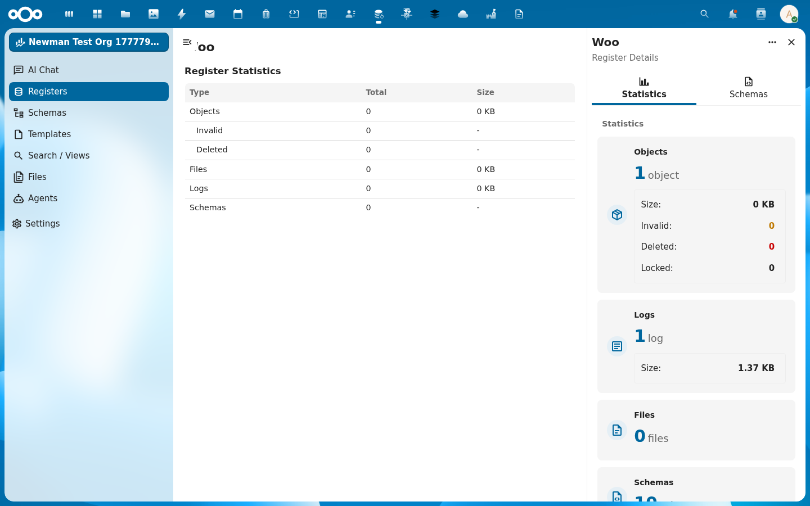
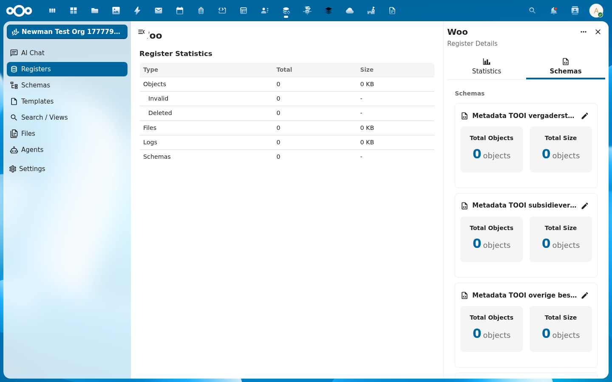

import {Outcomes, Outcome, Prerequisites, PrerequisiteItem, ContactCta} from '@conduction/docusaurus-preset/components';

The [Dutch Open Government Act (Woo)](https://www.rijksoverheid.nl/onderwerpen/wet-open-overheid-woo) requires government bodies to publish documents in eleven information categories. OpenRegister provides the storage model for that. In this tutorial you import the canonical Woo register, with all [TOOI](https://standaarden.overheid.nl/tooi) categories, in a few minutes.

{/* truncate */}

<Outcomes title="What you'll learn">
  <Outcome>How to create one register with the slug <code>woo</code> in your OpenRegister installation.</Outcome>
  <Outcome>How to import ten schemas, one per Woo information category.</Outcome>
  <Outcome>How to set up a working starting point for creating publications and attaching files.</Outcome>
</Outcomes>

The <a href="/academy/woo-bestanden-uploaden">follow-up tutorial on uploading files</a> builds on this.

<Prerequisites title="What you need">
  <PrerequisiteItem>A running Nextcloud with OpenRegister installed. If you do not have that yet, first follow <a href="/academy/nextcloud-lokaal-draaien">Run Nextcloud locally with Docker</a>.</PrerequisiteItem>
  <PrerequisiteItem>A user with admin rights, or a user allowed to create registers.</PrerequisiteItem>
  <PrerequisiteItem><code>curl</code> or a comparable HTTP client.</PrerequisiteItem>
</Prerequisites>

In the examples we use the local dev environment at `http://localhost:8080` with `admin:admin`. Replace those with your own host and credentials.

## The canonical source

The Woo register already exists, published by Conduction on GitHub:

```
https://raw.githubusercontent.com/ConductionNL/woo-website/main/website/static/oas/woo_register.json
```

It is an OpenAPI bundle of 1.0.1, with one register (`woo`) and ten schemas. Each schema contains the [TOOI metadata](https://standaarden.overheid.nl/diwoo/metadata/doc/0.9.1/diwoo-metadata-lijsten_xsd_Simple_Type_diwoo_scw_woo_informatiecategorieen) of one Woo information category:

| Slug | Category |
| --- | --- |
| `vergaderstukken_decentrale_overheden` | Meeting documents of decentralised authorities |
| `subsidieverplichtingen_anders_dan_met_beschikking` | Subsidy obligations without a decision |
| `overige_besluiten_van_algemene_strekking` | Other decisions of general scope |
| `organisatie_en_werkwijze` | Organisation and working methods |
| `ontwerpen_van_wet_en_regelgeving_met_adviesaanvraag` | Drafts of laws and regulations |
| `onderzoeksrapporten` | Research reports |
| `klachtoordelen` | Complaint rulings |
| `wetten_en_algemeen_verbindende_voorschriften` | Laws and generally binding regulations |
| `woo_verzoeken_en_besluiten` | Woo requests and decisions |
| `convenanten` | Covenants |
| `agendas_en_besluitenlijsten_bestuurscolleges` | Agendas and decision lists of executive boards |
| `vergaderstukken_staten_generaal` | Meeting documents of the States General |
| `adviezen` | Advisory reports |

## Step 1: Import the register

OpenRegister has an `import/url` endpoint that fetches an OpenAPI bundle and converts it in one transaction into register, schemas, and (optionally) seed objects.

```bash
curl -u admin:admin \
  -X POST "http://localhost:8080/index.php/apps/openregister/api/configurations/import/url" \
  -H "OCS-APIRequest: true" \
  -H "Content-Type: application/json" \
  -d '{
    "url": "https://raw.githubusercontent.com/ConductionNL/woo-website/main/website/static/oas/woo_register.json"
  }'
```

If all goes well, you get back:

```json
{
  "success": true,
  "message": "Configuration imported successfully from url",
  "configurationId": 271,
  "result": {
    "registersCount": 1,
    "schemasCount": 10,
    "objectsCount": 0
  }
}
```

`registersCount: 1` and `schemasCount: 10` confirm that everything was created. The `configurationId` is what you need later if you want to re-sync the source.

## Step 2: Verify what was created

Request the list of registers and filter on slug `woo`:

```bash
curl -u admin:admin \
  "http://localhost:8080/index.php/apps/openregister/api/registers" \
  -H "OCS-APIRequest: true"
```

In the response you find an entry like:

```json
{
  "id": 924,
  "uuid": "cd44ca36-e3de-4d6f-9af9-abbb49710c83",
  "slug": "woo",
  "title": "Woo",
  "version": "1.0.1",
  "description": "Woo register with TOOI information categories",
  "schemas": [1619, 1620, 1621, 1622, 1623, 1624, 1625, 1626, 1627, 1628]
}
```

The `id` is your internal register id (924 in this example, yours may differ). The slug `woo` is stable and you use it in all further API calls.

In the UI you find the register under **Apps -> OpenRegister -> Registers**:


Click **View Details** in the Actions menu of the card for a statistics panel:



## Step 3: Look at the schemas

The TOOI schemas are metadata schemas. Each schema contains seven fields:

| Field | Type | Description |
| --- | --- | --- |
| `tooiCategorieNaam` | string (required) | Name of the category |
| `tooiCategorieId` | string | TOOI id, for example `c_fdaee95e` |
| `tooiCategorieUri` | string | Full TOOI URI |
| `tooiThemaNaam` | string | Optional theme |
| `tooiThemaId` | string | Optional theme id |
| `tooiThemaUri` | string | Optional theme URI |
| `values` | array | Free-form key-value pairs |

The `categorieId` and `categorieUri` are `const` in the schema. You do not have to fill them yourself. OpenRegister fills them automatically as soon as you set `tooiCategorieNaam`.



## Step 4: Create your first publication

Test your register with one publication. We use the category `onderzoeksrapporten`:

```bash
curl -u admin:admin \
  -X POST "http://localhost:8080/index.php/apps/openregister/api/objects/woo/onderzoeksrapporten" \
  -H "OCS-APIRequest: true" \
  -H "Content-Type: application/json" \
  -d '{
    "tooiCategorieNaam": "onderzoeksrapporten"
  }'
```

The response shows, among other things:

```json
{
  "id": "3422e6cd-1ba5-478c-b842-8f206f9d7358",
  "tooiCategorieNaam": "onderzoeksrapporten",
  "tooiCategorieId": "c_fdaee95e",
  "tooiCategorieUri": "https://identifier.overheid.nl/tooi/def/thes/kern/c_fdaee95e",
  "@self": {
    "register": "924",
    "schema": "1624",
    "uri": "http://localhost:8080/apps/openregister/api/objects/924/1624/3422e6cd-...",
    "owner": "admin",
    "created": "2026-05-07T05:12:24+00:00"
  }
}
```

OpenRegister filled in the TOOI id and URI itself. The object has a UUID. Remember that UUID. You need it to attach files to this publication.

## Step 5 (optional): Add your own fields

The canonical schemas cover the TOOI metadata, not the content of the publication itself. For title, description, date, and responsible organisation, you create your own additional schema, or extend an existing one.

A minimal extension for `onderzoeksrapporten` looks like this:

```json
{
  "title": "Research report publication",
  "properties": {
    "titel": { "type": "string", "maxLength": 255 },
    "omschrijving": { "type": "string", "maxLength": 2000 },
    "openbaarmakingsdatum": { "type": "string", "format": "date" },
    "verantwoordelijkeOrganisatie": { "type": "string" }
  },
  "required": ["titel", "openbaarmakingsdatum"]
}
```

You can create such a schema via `POST /api/schemas` and then add it to the Woo register configuration. Keep it as close as possible to the [DiWoo metadata standard](https://standaarden.overheid.nl/diwoo) so your publications can be picked up by [PLOOI](https://open.overheid.nl) and [woogle.nl](https://woogle.nl) as well.

## And now

You have:

- A working Woo register with ten TOOI schemas
- One test publication with a UUID
- A pattern to add your own fields where needed

In the [follow-up tutorial you attach files to this publication](/academy/woo-bestanden-uploaden), from a few PDFs to large video files in chunks.

## Cleanup

If you want to delete the test register:

```bash
curl -u admin:admin \
  -X DELETE "http://localhost:8080/index.php/apps/openregister/api/registers/924" \
  -H "OCS-APIRequest: true"
```

This removes the register, all schemas, and all objects. The configuration import itself remains, so you can replay it.

<ContactCta
  title="Want to know more?"
  body="Send us an email. We help you set up your own Woo register in half a day, including publication schemas and connections to existing systems."
  cta={{ label: "Email us", href: "mailto:info@conduction.nl?subject=Woo-register" }}
/>
