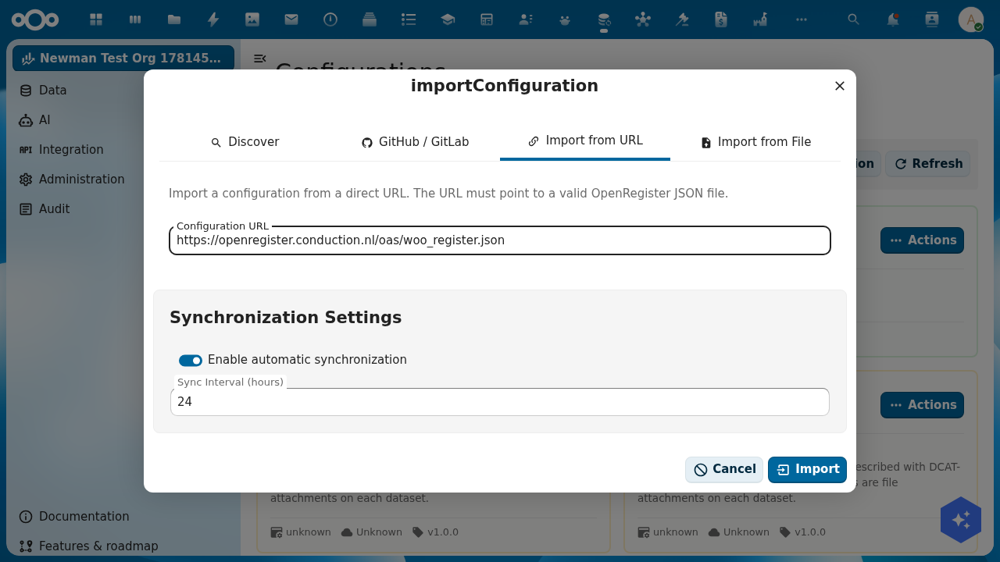
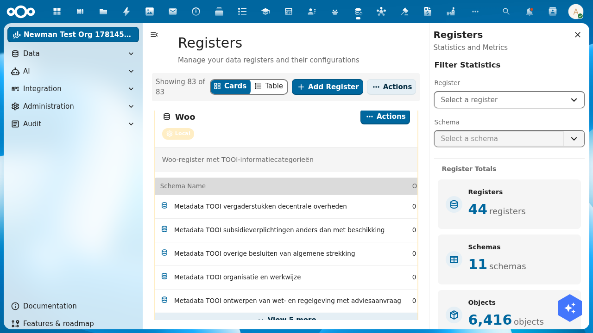
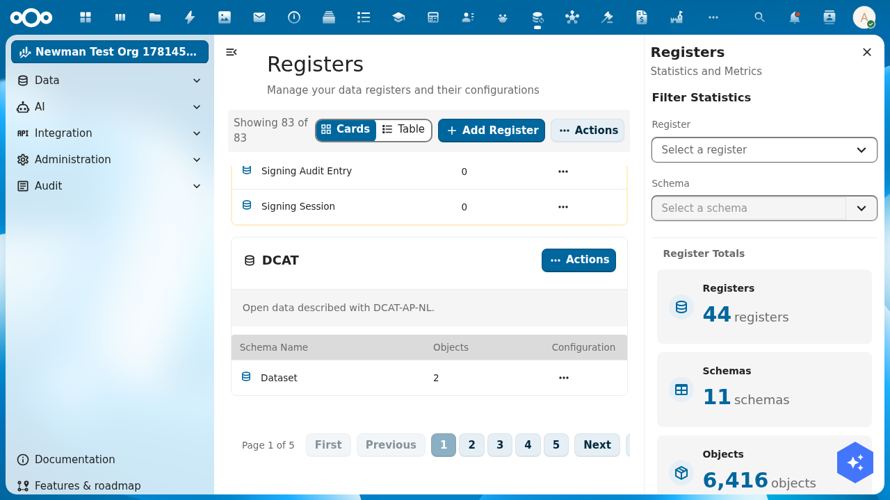

import {Outcomes, Outcome, Prerequisites, PrerequisiteItem, ContactCta} from '@conduction/docusaurus-preset/components';

The [Dutch Open Government Act (Woo)](https://www.rijksoverheid.nl/onderwerpen/wet-open-overheid-woo) asks government bodies to publish documents in set information categories. Open data is published as datasets in the [DCAT-AP-NL](https://data.overheid.nl/dcat-ap-nl) standard. OpenRegister stores both. In this tutorial you import two registers, the Woo register and a DCAT register, using only the OpenRegister interface.

{/* truncate */}

<Outcomes title="What you'll learn">
  <Outcome>How to import the canonical Woo register, with all ten TOOI categories, through the OpenRegister interface.</Outcome>
  <Outcome>How to import a DCAT register for open-data datasets the same way.</Outcome>
  <Outcome>How to read what the import created: registers, schemas, and their fields.</Outcome>
  <Outcome>A working starting point for creating publications, datasets, and attaching files.</Outcome>
</Outcomes>

The <a href="/academy/woo-upload-files">follow-up tutorial on uploading files</a> builds on this.

<Prerequisites title="What you need">
  <PrerequisiteItem>A running Nextcloud with OpenRegister installed. If you do not have that yet, first follow <a href="/academy/run-nextcloud-locally">Run Nextcloud locally with Docker</a>.</PrerequisiteItem>
  <PrerequisiteItem>A user with admin rights, or a user allowed to create registers.</PrerequisiteItem>
  <PrerequisiteItem>Open the OpenRegister app from the Nextcloud app menu.</PrerequisiteItem>
</Prerequisites>

## The canonical sources

Both registers are published as OpenRegister configuration files, hosted by Conduction at [conduction.nl/oas](https://conduction.nl/oas/). You do not edit them; you point OpenRegister at the URL and it does the rest.

| Register | Configuration URL |
| --- | --- |
| Woo | `https://conduction.nl/oas/woo_register.json` |
| DCAT | `https://conduction.nl/oas/dcat_register.json` |

The Woo file holds one register (`woo`) and ten schemas, one per Woo information category, each carrying the [TOOI metadata](https://standaarden.overheid.nl/tooi). The DCAT file holds one register (`dcat`) with a `Dataset` schema aligned to DCAT-AP-NL.

## Step 1: Import the Woo register

In OpenRegister, open **Administration → Configurations** in the left menu. Click **Import Configuration**, then choose the **Import from URL** tab. Paste the Woo configuration URL and leave the synchronisation settings on their defaults.

Click **Import**. OpenRegister fetches the file and, in one transaction, creates the register, its schemas, and any seed objects. A confirmation appears when it finishes.

## Step 2: Import the DCAT register

Repeat Step 1 with the DCAT configuration URL. Open **Import Configuration → Import from URL**, paste `https://conduction.nl/oas/dcat_register.json`, and click **Import**.

You now have two registers. Open data and Woo publications live side by side, each in its own register.

## Step 3: See what was created

Open **Data → Registers** in the left menu. The Woo register shows its ten TOOI schemas, one per information category.

The DCAT register shows its single `Dataset` schema.

Each card has an **Actions** menu with **View Details** for a statistics panel: number of objects, files, logs, and schemas per register.

## Step 4: Look at the schemas

The Woo TOOI schemas are metadata schemas. Each holds the same seven fields:

| Field | Type | Description |
| --- | --- | --- |
| `tooiCategorieNaam` | string (required) | Name of the category |
| `tooiCategorieId` | string | TOOI id, for example `c_fdaee95e` |
| `tooiCategorieUri` | string | Full TOOI URI |
| `tooiThemaNaam` | string | Optional theme |
| `tooiThemaId` | string | Optional theme id |
| `tooiThemaUri` | string | Optional theme URI |
| `values` | array | Free-form key-value pairs |

`tooiCategorieId` and `tooiCategorieUri` are fixed per schema. OpenRegister fills them automatically once you set `tooiCategorieNaam`.

The DCAT `Dataset` schema holds the DCAT-AP-NL dataset fields: `title`, `description`, `tags` (keywords), `category` (theme), `license`, `publicatiedatum`, `landingPage`, and `publisher`. A dataset's files become its distributions.

To inspect a schema, open **Data → Schemas** and click any schema to see its fields.

## Step 5: Create your first object

Test a register with one object, without leaving the interface.

Open **Data → Registers**, open the Woo register, and pick the `onderzoeksrapporten` (Research reports) schema. Click **Add object**, set `tooiCategorieNaam` to `onderzoeksrapporten`, and save. OpenRegister fills in the TOOI id and URI for you and assigns the object a UUID.

Do the same in the DCAT register: open the `Dataset` schema, click **Add object**, and give it a `title`, a `category`, and a `publicatiedatum`. You now have one Woo publication and one open-data dataset.

Keep the UUIDs in mind. You need them in the next tutorial to attach files.

## And now

You have:

- A Woo register with ten TOOI schemas
- A DCAT register with a Dataset schema
- One test publication and one test dataset
- Everything created through the interface, no command line

In the [follow-up tutorial you attach files to a publication](/academy/woo-upload-files), from a few PDFs to large video files.

## Cleanup

To remove a register, open **Data → Registers**, open the register's **Actions** menu, and choose **Delete**. This removes the register, its schemas, and its objects. The configuration import remains, so you can replay it later.

<ContactCta
  title="Want to know more?"
  body="Send us an email. We help you set up your own Woo and open-data registers in half a day, including publication schemas and connections to existing systems."
  cta={{ label: "Email us", href: "mailto:info@conduction.nl?subject=Woo-register" }}
/>
