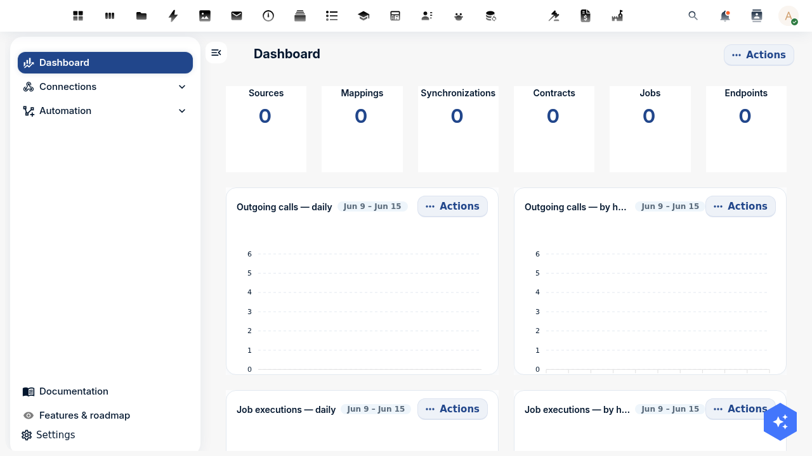
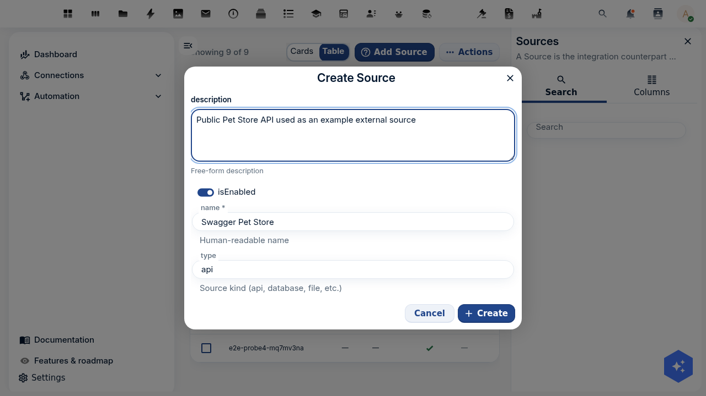
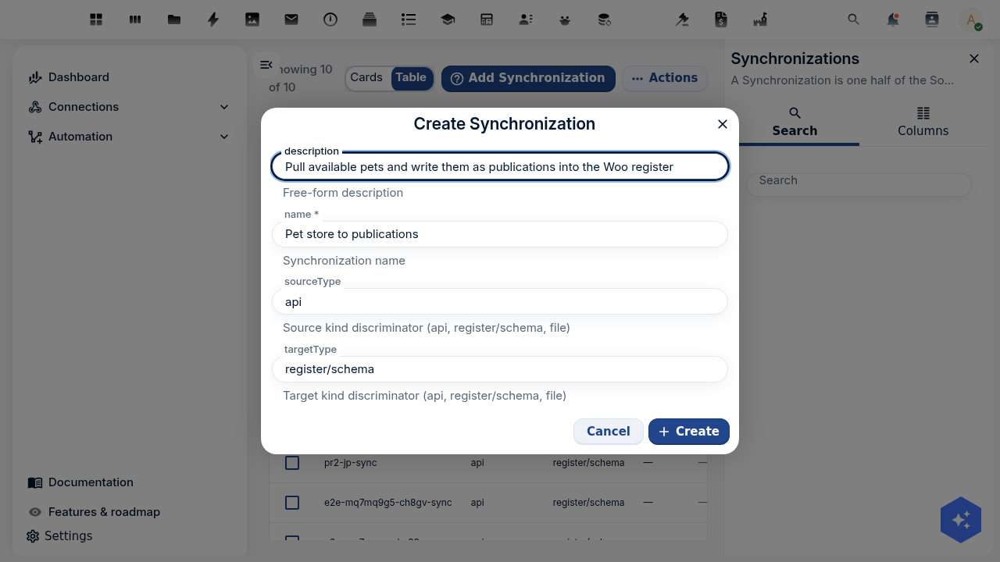

import {
  Outcomes,
  Outcome,
  Prerequisites,
  PrerequisiteItem,
  NextSteps,
  NextStep,
  HexCard,
  Troubleshooting,
  ContactCta,
} from '@conduction/docusaurus-preset/components';
import Details from '@theme/Details';
import Tabs from '@theme/Tabs';
import TabItem from '@theme/TabItem';

The first three parts of this series set up the registers, the files, and a public catalog for Dutch open-government data. Conduction also has a **three-tutorial pipeline** that teaches the same three apps from the ground up, end to end, on the canonical Pet Store sample:

1. [Model and manage your data with OpenRegister](/academy/model-data-with-openregister) — registers, schemas, relations, objects, search, versioning, permissions.
2. [Pull external data into your register with Integriq](/academy/pull-data-with-openconnector) — a source, a mapping, and a scheduled synchronisation.
3. [Publish a public catalog with OpenCatalogi](/academy/publish-catalog-with-opencatalogi) — scope a catalog, publish with a date rule, expose a DCAT-AP-NL feed.

This capstone is the **Woo & DCAT overlay** on that pipeline. Rather than repeat the mechanics, it points you at each deep tutorial and then layers the open-government specifics on top: the canonical registers you import instead of hand-building, the open-data source you map to a `Dataset`, and the DCAT-AP-NL feed that national portals harvest. The shape is identical to the Pet Store chain — *grab data from a source, and publish it on a catalog* — only the domain changes.

{/* truncate */}

:::tip How this fits together
Each deep tutorial below stands alone and uses the Pet Store. This page is the bridge: read a deep tutorial for the *how*, then apply the Woo overlay here for the *open-data what*. If you have already followed Parts <a href="/academy/woo-set-up-register">1</a>, <a href="/academy/woo-upload-files">2</a> and <a href="/academy/woo-publish-and-harvest-catalog">3</a>, this ties them into one chain.
:::

<Outcomes title="What you'll have at the end">
  <Outcome>A clear map from the generic register → connector → catalog pipeline to a compliant Woo / DCAT-AP-NL open-data chain.</Outcome>
  <Outcome>An external open-data API registered as a <strong>source</strong> and mapped onto the canonical <code>Dataset</code> schema, publishing on arrival.</Outcome>
  <Outcome>A catalog scoped to your DCAT register, with the <code>publicatiedatum</code> rule deciding what the public sees.</Outcome>
  <Outcome>A <strong>DCAT-AP-NL</strong> feed at <code>/api/dcat</code> that <a href="https://data.overheid.nl">data.overheid.nl</a> and <a href="https://data.europa.eu">data.europa.eu</a> can harvest.</Outcome>
</Outcomes>

<Prerequisites title="What you need">
  <PrerequisiteItem>A running Nextcloud with <strong>OpenRegister</strong>, <strong>Integriq</strong> and <strong>OpenCatalogi</strong> installed.</PrerequisiteItem>
  <PrerequisiteItem>The DCAT register and catalog from <a href="/academy/woo-publish-and-harvest-catalog">Part 3</a> (or import them as the overlay below describes).</PrerequisiteItem>
  <PrerequisiteItem>A user with admin rights. Comfort with the three deep tutorials helps, but is not required.</PrerequisiteItem>
</Prerequisites>

## The chain at a glance

The whole pipeline is three apps in a row. Each generic tutorial teaches one stage on the Pet Store; the Woo overlay swaps the pet domain for the open-data one. Nothing about the mechanics changes.

| Stage | What runs | Learn the mechanics | The Woo / DCAT overlay |
| --- | --- | --- | --- |
| **1. Model** | OpenRegister | [Model your data with OpenRegister](/academy/model-data-with-openregister) | Import the canonical **Woo** and **DCAT** registers instead of hand-building a `pet` schema. |
| **2. Pull** | Integriq | [Pull data with Integriq](/academy/pull-data-with-openconnector) | Point the source at an **open-data API** and map records onto the `Dataset` schema, publishing on arrival. |
| **3. Publish** | OpenCatalogi | [Publish a catalog with OpenCatalogi](/academy/publish-catalog-with-opencatalogi) | Scope the catalog to the **DCAT register** and expose a **DCAT-AP-NL** feed for national harvesters. |

<HexCard title="One pipeline, two domains">
  The Pet Store chain and the Woo chain are the same three objects — a register, a synchronisation, a catalog — wired the same way. A pet schema becomes a <code>Dataset</code> schema; a Swagger pet becomes an open-data record; a "pets in the shop window" catalog becomes a national open-data feed. Learn the chain once on pets, and you can publish any register-backed data, government or not.
</HexCard>

## Overlay 1: the register — import the canonical Woo & DCAT models

The deep [OpenRegister tutorial](/academy/model-data-with-openregister) builds a register and its schemas by hand. For Woo you do not hand-build anything: the **Woo register** (with its ten TOOI information categories) and a **DCAT register** (for open-data `Dataset` objects) are published as OpenRegister configuration files and imported from a URL, exactly as the deep tutorial's final step (export & import configuration) describes.

This is [Part 1 of the Woo series](/academy/woo-set-up-register): open **OpenRegister → Administration → Configurations → Import Configuration → Import from URL** and point it at the canonical configuration. OpenRegister recreates the register, its schemas and their TOOI categories in one transaction.

<HexCard title="Why import, not build">
  The Woo and DCAT-AP-NL data models are standards, not choices. Importing the canonical configuration means your <code>Dataset</code> schema has the exact fields a harvester expects — <code>title</code>, <code>description</code>, <code>category</code>, <code>license</code>, <code>publicatiedatum</code> — and stays aligned when the standard moves. The import mechanism is the same one the OpenRegister tutorial teaches; you are just consuming a published model instead of authoring your own.
</HexCard>

**Apply the overlay:** after [Part 1](/academy/woo-set-up-register) you have a DCAT register with a `Dataset` schema, the target for everything below.

## Overlay 2: the source — map an open-data API onto a Dataset

The deep [Integriq tutorial](/academy/pull-data-with-openconnector) pulls pets from the Swagger Pet Store into a `pet` schema. The Woo overlay changes only two things: the source is an open-data API, and the mapping targets the `Dataset` schema with one extra field that publishes the record the moment it arrives.

Integriq splits every integration into three objects, built in order — exactly as the deep tutorial details:

1. **Source**: *where* the data comes from (a base URL and how to authenticate).
2. **Mapping**: *how* a record is reshaped (each `Dataset` field is a [Twig](https://twig.symfony.com/) expression over the source record).
3. **Synchronisation**: *what* runs (it pulls an endpoint, applies the mapping, and writes into the DCAT register on a schedule).



### Register the open-data API as a source

Follow Step 1 of the [deep tutorial](/academy/pull-data-with-openconnector) — **Integriq → Sources → Add Source**, set the type to `api` and the location to your open-data API's base URL — then test the connection. For a secured government API you set the authentication on the source; Integriq stores the credentials encrypted.



### Map records onto the Dataset schema

The only Woo-specific step. Where the Pet Store mapping produced `{ name, species, status }`, the Woo mapping produces a `Dataset`, and it sets `publicatiedatum` to *now* so the dataset is public the instant it lands — that is the field the catalog keys visibility on (Overlay 3).

| `Dataset` field | Twig expression |
| --- | --- |
| `title` | `{{ name }}` |
| `description` | `{{ description }}` |
| `category` | `{{ category.name }}` |
| `status` | `Published` |
| `publicatiedatum` | `{{ "now"\|date("Y-m-d H:i:s") }}` |

Use the mapping's **Test mapping** action against a sample record before wiring it up, just as the deep tutorial shows, so you can see the reshaped `Dataset` before it writes anything.

### Tie it together and run

Create the synchronisation (source + endpoint + results position + id position + mapping + the DCAT register and `Dataset` schema as the target), then **Run** it. The run reports how many records it found, created, updated and skipped; on a re-run the **id position** deduplicates so the register tracks the source without duplicates.



<Tabs groupId="woo-how">
<TabItem value="ui" label="UI">

Do the click-path in the [deep Integriq tutorial](/academy/pull-data-with-openconnector): create the source, write the mapping with the `Dataset` fields above, create the synchronisation pointing at your DCAT register and `Dataset` schema, and run it. The only differences from the pet chain are the source URL, the five mapping rows above, and the target schema.

</TabItem>
<TabItem value="api" label="API">

The API calls are identical to the deep tutorial's; only the mapping body and the target change. Replace `<DCAT_REGISTER>/<DATASET_SCHEMA>` with your ids:

```bash
# Mapping: reshape an open-data record into a Dataset, publishing on arrival
curl -u admin:admin -X POST "http://localhost:8080/index.php/apps/openconnector/api/mappings" \
  -H "OCS-APIRequest: true" -H "Content-Type: application/json" \
  -d '{ "name": "Source to dataset", "passThrough": false, "mapping": {
        "title": "{{ name }}", "description": "{{ description }}",
        "category": "{{ category.name }}", "status": "Published",
        "publicatiedatum": "{{ \"now\"|date(\"Y-m-d H:i:s\") }}" } }'

# Synchronisation: source → mapping → DCAT register/schema
curl -u admin:admin -X POST "http://localhost:8080/index.php/apps/openconnector/api/synchronizations" \
  -H "OCS-APIRequest: true" -H "Content-Type: application/json" \
  -d '{ "name": "Open data to datasets", "sourceId": "<SOURCE_UUID>", "sourceType": "api",
        "sourceTargetMapping": "<MAPPING_UUID>",
        "sourceConfig": { "endpoint": "<ENDPOINT>", "resultsPosition": "_root", "idPosition": "id" },
        "targetType": "register/schema", "targetId": "<DCAT_REGISTER>/<DATASET_SCHEMA>" }'
```

</TabItem>
<TabItem value="php" label="PHP">

```php
use OCA\OpenRegister\Service\ObjectService;
use OCA\OpenConnector\Service\SynchronizationService;

$objects = \OCP\Server::get(ObjectService::class);

$mapping = $objects->saveObject(
    object: [
        'name'        => 'Source to dataset',
        'passThrough' => false,
        'mapping'     => [
            'title'           => '{{ name }}',
            'description'     => '{{ description }}',
            'category'        => '{{ category.name }}',
            'status'          => 'Published',
            'publicatiedatum' => '{{ "now"|date("Y-m-d H:i:s") }}',
        ],
    ],
    register: 'openconnector', schema: 'mapping',
);
// Build the synchronisation against the DCAT register/schema and run it via SynchronizationService,
// exactly as the deep Integriq tutorial shows.
```

</TabItem>
</Tabs>

<HexCard title="publicatiedatum is the hinge between pull and publish">
  Setting <code>publicatiedatum</code> to <code>now</code> in the mapping is what makes an imported record public the moment it arrives. It is the same field the catalog's publish rule checks in Overlay 3 — so the two stages meet on this one value. Want a review step before data goes live? Leave <code>publicatiedatum</code> empty in the mapping and set it by hand (or with a flow) once a record is approved.
</HexCard>

**Apply the overlay:** open the DCAT register in OpenRegister and the imported `Dataset` objects are there, already carrying a `publicatiedatum` of now.

## Overlay 3: publish — scope the catalog and expose a DCAT-AP-NL feed

The deep [OpenCatalogi tutorial](/academy/publish-catalog-with-opencatalogi) explains the publish model in full: a catalog is a filter (a registers + schemas scope), and visibility is an OpenRegister RBAC rule that grants the `public` group read **only when `publicatiedatum` is at or before now**. There is no "publish" button. The Woo overlay is simply that the catalog scopes to your **DCAT register** and the public reads it as **DCAT-AP-NL**.

Follow [Part 3 of the Woo series](/academy/woo-publish-and-harvest-catalog) to scope the `publications` catalog to the DCAT register and `Dataset` schema. Then read it as an anonymous visitor — the future-dated and undated datasets stay hidden, exactly as the deep tutorial proves from a logged-out browser:

```
https://your-host/index.php/apps/opencatalogi/api/publications
```

### The DCAT-AP-NL feed

This is the genuinely open-government payoff. [DCAT-AP-NL](https://data.overheid.nl/dcat-ap-nl) is the Dutch profile of the W3C DCAT vocabulary, and it is what `data.overheid.nl` and `data.europa.eu` harvest. OpenCatalogi renders your published datasets as DCAT-AP-NL — each `Dataset` as a `dcat:Dataset`, each attached file (from [Part 2](/academy/woo-upload-files)) as a `dcat:Distribution` — from the same objects, with no extra storage and no new schema. Open the feed anonymously:

```
https://your-host/index.php/apps/opencatalogi/api/dcat
```

You get a JSON-LD document carrying the `data.overheid.nl/dcat-ap-nl/3.0` profile. Each published dataset becomes a `dcat:Dataset` and each file a `dcat:Distribution`:

```json
{
  "@context": {
    "dcat": "http://www.w3.org/ns/dcat#",
    "dct": "http://purl.org/dc/terms/",
    "profile": "https://data.overheid.nl/dcat-ap-nl/3.0"
  },
  "@graph": [
    {
      "@id": "https://your-host/index.php/apps/opencatalogi/api/dcat",
      "@type": "dcat:Catalog",
      "dct:title": "OpenCatalogi",
      "dcat:dataset": [{ "@id": "https://your-host/.../objects/427/1428/5bbd2b06" }]
    },
    {
      "@id": "https://your-host/.../objects/427/1428/5bbd2b06",
      "@type": "dcat:Dataset",
      "dct:title": "Energielabels per adres 2026",
      "dct:description": "Voorlopige energielabels gekoppeld aan BAG-adressen.",
      "dcat:keyword": ["energie", "bag", "wonen"],
      "dcat:theme": { "@id": "http://publications.europa.eu/resource/authority/data-theme/ECON" },
      "dct:license": "CC0-1.0",
      "dct:modified": "2026-03-01",
      "dct:identifier": "5bbd2b06-565f-4d65-9dfe-3b79398acf15",
      "dcat:landingPage": { "@id": "https://your-host/.../objects/427/1428/5bbd2b06" },
      "dcat:distribution": [
        {
          "@type": "dcat:Distribution",
          "dct:title": "energielabels-2026.csv",
          "dcat:downloadURL": { "@id": "https://your-host/.../files/energielabels-2026.csv" },
          "dcat:mediaType": "text/csv",
          "dct:format": { "@id": "http://publications.europa.eu/resource/authority/file-type/CSV" }
        }
      ]
    }
  ]
}
```

To publish a single catalog as its own harvestable feed, enable **DCAT** on the catalog and read its per-catalog endpoint at `/api/catalogs/publications/dcat`. The per-catalog feed lists your published datasets as `dcat:Dataset` nodes and honours the same `publicatiedatum` visibility rule.

:::note
The per-catalog `/dcat` endpoint and the dataset nodes are gated behind a DCAT-harvesting flag on the catalog; the deep [OpenCatalogi tutorial](/academy/publish-catalog-with-opencatalogi#step-4-expose-the-catalog-as-a-dcat-ap-nl-feed) covers this in detail. The public `/api/publications` API needs no flag and is the endpoint to verify against first.
:::

**Apply the overlay:** a national portal points at your `/api/dcat` (or per-catalog) feed on a schedule and lists your published datasets alongside everyone else's open data. The chain is complete: an external source feeds the register, and the register feeds the open-data web.

## Test yourself

<Details summary="The synchronisation runs but creates zero datasets. Where do you look first?">

The results position. If it does not point at the list of records in the source response, Integriq finds nothing to process. Open the source endpoint in a browser and check where the array sits — a bare top-level array is `_root`. The deep Integriq tutorial has the full troubleshooting list.
</Details>

<Details summary="Datasets import but never show in public search. What did the mapping miss?">

`publicatiedatum`. The catalog's publish rule only shows the `public` group a dataset whose date is now or earlier. Set `publicatiedatum` to now in the mapping (Overlay 2) so records are public on arrival, or set it by hand after a review step.
</Details>

<Details summary="What does a national portal like data.overheid.nl read — the search API or the DCAT feed?">

The DCAT feed. `/api/dcat` and the per-catalog `/dcat` endpoint render your datasets as DCAT-AP-NL, the format harvesters expect. The `/api/publications` search API is for people and applications.
</Details>

<Details summary="Why import the Woo and DCAT registers instead of building schemas by hand?">

DCAT-AP-NL is a standard. Importing the canonical configuration gives your `Dataset` schema the exact fields a harvester expects and keeps it aligned as the standard evolves. The import mechanism is the same export/import the OpenRegister tutorial teaches.
</Details>

## Where to go from here

You have the whole chain: an external API feeds your register, a catalog publishes it, and a DCAT-AP-NL feed makes it harvestable — new records flowing in on a schedule and out to the open-data web. From here, deepen any link in the chain, or rebuild it for your own domain.

<NextSteps>
  <NextStep title="Deep dive: OpenRegister" href="/academy/model-data-with-openregister" summary="Registers, schemas, relations, objects, search, versioning and permissions, end to end." />
  <NextStep title="Deep dive: Integriq" href="/academy/pull-data-with-openconnector" summary="Sources, Twig mappings, synchronisations and scheduling, with id-based deduplication." />
  <NextStep title="Deep dive: OpenCatalogi" href="/academy/publish-catalog-with-opencatalogi" summary="Catalog scope, the RBAC publish rule, anonymous verification and the DCAT-AP-NL feed." />
  <NextStep title="Part 3: Publish and harvest a catalog with DCAT-AP" href="/academy/woo-publish-and-harvest-catalog" summary="The catalog, publish rule, and DCAT feed in the Woo domain." />
</NextSteps>

<ContactCta />
