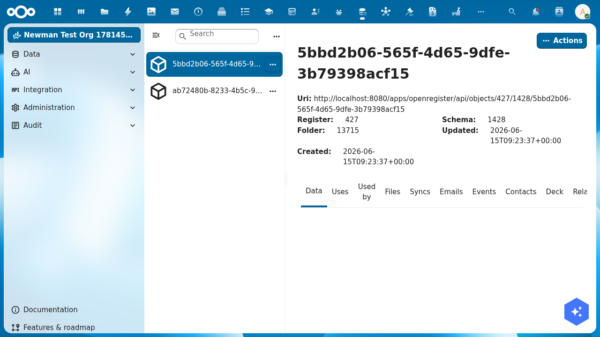
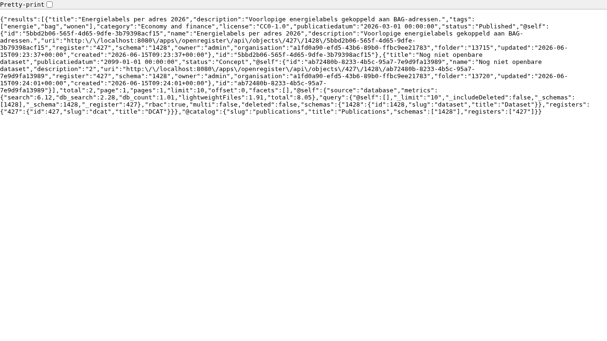
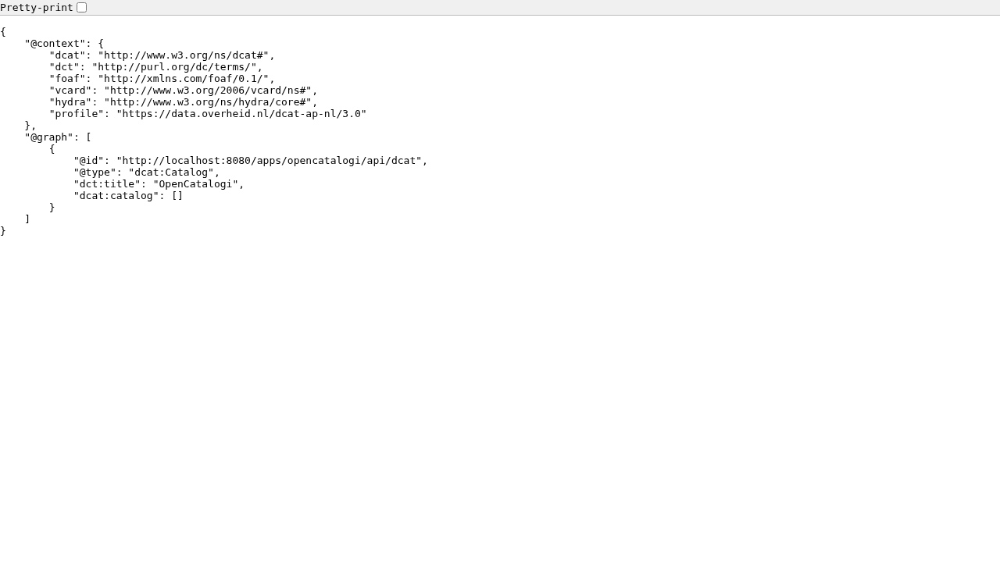

import {Outcomes, Outcome, Prerequisites, PrerequisiteItem, NextSteps, NextStep, ContactCta} from '@conduction/docusaurus-preset/components';
import Details from '@theme/Details';

:::tip Recommended first
This is Part 3 of the Woo tutorial series. Start with <a href="/academy/woo-set-up-register">Set up Woo and DCAT registers</a> and <a href="/academy/woo-upload-files">Upload files to a Woo publication</a>.
:::

In Part 1 you imported a DCAT register for open data. In this tutorial you make its datasets findable: you scope a catalog to the register, set one date field that controls visibility, and expose the catalog as a [DCAT-AP-NL](https://data.overheid.nl/dcat-ap-nl) feed. National portals like [data.overheid.nl](https://data.overheid.nl) harvest that feed.

{/* truncate */}

<Outcomes title="What you'll learn">
  <Outcome>How to scope an OpenCatalogi catalog to your register, so it knows which objects to serve.</Outcome>
  <Outcome>How the <code>publicatiedatum</code> field controls what anonymous visitors can see.</Outcome>
  <Outcome>How to verify that public search returns only published datasets.</Outcome>
  <Outcome>How to expose your catalog as a DCAT-AP-NL feed for national open-data harvesters.</Outcome>
</Outcomes>

<Prerequisites title="What you need">
  <PrerequisiteItem>A running Nextcloud with OpenRegister <strong>and</strong> OpenCatalogi installed.</PrerequisiteItem>
  <PrerequisiteItem>The DCAT register from <a href="/academy/woo-set-up-register">Part 1</a>, with its <code>Dataset</code> schema.</PrerequisiteItem>
  <PrerequisiteItem>A user with admin rights.</PrerequisiteItem>
</Prerequisites>

## How publishing works in OpenCatalogi

OpenCatalogi has no separate "publish" button. Visibility is a rule on the schema, enforced by OpenRegister:

> Anyone (the `public` group) may read a dataset when its `publicatiedatum` is now or earlier.

So three things decide whether an anonymous visitor sees a dataset:

1. The dataset lives in a register and schema that a **catalog** points at.
2. The dataset has a `publicatiedatum` that is **now or earlier**.
3. The visitor reads it through a **public endpoint**.

The next steps set up all three.

## Step 1: Create a dataset

Open **OpenRegister → Data → Registers**, open your DCAT register, and open the `Dataset` schema. Click **Add object** and fill in a title, a description, a few tags, a category (the DCAT theme), and a `publicatiedatum` in the past, for example `2026-03-01 00:00:00`. Save.

You now have a dataset. OpenRegister shows it with its register, schema, and dates.



To see the visibility rule at work, add a second dataset with a `publicatiedatum` in the **future**, for example `2099-01-01`. It stays hidden from the public until that date.

## Step 2: Scope a catalog to your register

OpenCatalogi ships one catalog with the slug `publications`. By default its scope is empty, so it serves nothing. Point it at your DCAT register.

In OpenCatalogi, open **Catalogue → Catalogs**, open the **Publications** catalog, and set its **Registers** to your DCAT register and its **Schemas** to the `Dataset` schema. Save. The catalog now knows which objects belong to it.

## Step 3: Verify public search

Read the catalog as an anonymous visitor. Open the public publications endpoint, using the catalog slug, with no login:

```
https://your-host/index.php/apps/opencatalogi/api/publications
```

You see only the published dataset. The future-dated one is gone.



Open the same register in OpenRegister as an admin and you see both datasets. The difference between the two is exactly your unpublished datasets. OpenRegister filters them in SQL; they never reach the public response.

:::warning
A dataset with an empty `publicatiedatum` is **not** public. The rule needs a date that is now or earlier. If a dataset does not appear in public search, check its `publicatiedatum` first.
:::

## Step 4: Expose the catalog as a DCAT-AP-NL feed

[DCAT-AP-NL](https://data.overheid.nl/dcat-ap-nl) is the exchange format for Dutch open data. `data.overheid.nl` and `data.europa.eu` harvest it. OpenCatalogi renders your published datasets as a DCAT catalog, with each dataset as a `dcat:Dataset` and its files as `dcat:Distribution`. No extra storage, no new schema.

Open the instance feed, anonymously:

```
https://your-host/index.php/apps/opencatalogi/api/dcat
```

You get a JSON-LD document with the DCAT-AP-NL profile (`data.overheid.nl/dcat-ap-nl/3.0`).



To publish a single catalog as its own harvestable feed, turn on **DCAT** on the catalog and read its per-catalog endpoint at `/api/catalogs/publications/dcat`. The per-catalog feed lists your published datasets as `dcat:Dataset` nodes and honours the same visibility rule as Step 3.

:::note
The per-catalog `/dcat` endpoint ships with OpenCatalogi 1.1 and later. On older builds, use the instance feed at `/api/dcat`.
:::

## Test yourself

<Details summary="You added a dataset but it does not show in public search. What do you check first?">

Its `publicatiedatum`. The public read rule only matches datasets with a date that is now or earlier. An empty or future date hides the dataset from anonymous visitors, by design.
</Details>

<Details summary="Why does the catalog need a registers and schemas scope?">

The catalog is a filter. Its registers and schemas tell OpenCatalogi which objects belong to it. An empty scope serves nothing, even when datasets exist.
</Details>

<Details summary="What does a national portal like data.overheid.nl read, the search API or the DCAT feed?">

The DCAT feed. `/api/dcat` and the per-catalog `/dcat` endpoint render your datasets as DCAT-AP-NL, the format harvesters expect. The search API is for people and applications.
</Details>

## Where to go from here

Your catalog is public and harvestable. So far you have entered datasets by hand. In a real deployment they come from another system: a case-management API, an open-data source, an existing register.

Part 4 of this series sets up that flow with OpenConnector.

<NextSteps>
  <NextStep title="Part 4: Pull external data into your register with OpenConnector" href="/academy/woo-connect-external-api" summary="Configure a source, a mapping, and a synchronisation that turn an external API into datasets." />
  <NextStep title="Part 1: Set up Woo and DCAT registers" href="/academy/woo-set-up-register" summary="The registers this tutorial builds on." />
</NextSteps>

<ContactCta />
