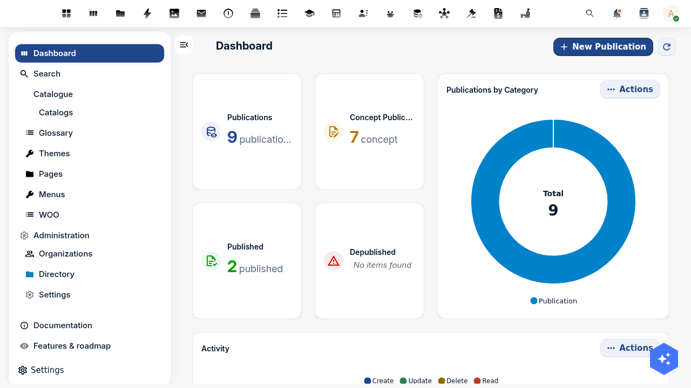
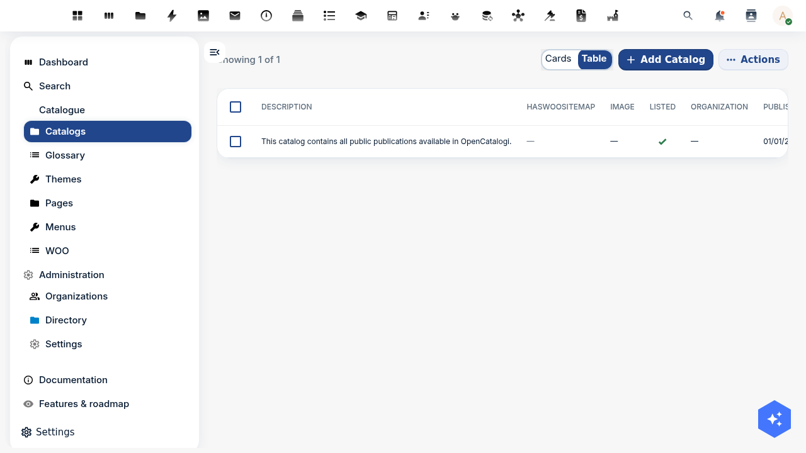

import {Outcomes, Outcome, Prerequisites, PrerequisiteItem, NextSteps, NextStep, AppMock, ContactCta} from '@conduction/docusaurus-preset/components';
import Details from '@theme/Details';

:::tip Recommended first
This is Part 3 of the Woo tutorial series. Start with <a href="/academy/woo-set-up-register">Set up a Woo register in OpenRegister</a> and <a href="/academy/woo-upload-files">Upload files to a Woo publication</a>.
:::

In Parts 1 and 2 you stored Woo publications and attached files. They are not public yet. In this tutorial you make them findable: you scope a catalog to your register, set one date field that controls visibility, and expose the catalog as a [DCAT-AP-NL](https://data.overheid.nl/dcat-ap-nl) feed. National portals like [data.overheid.nl](https://data.overheid.nl) harvest that feed.

{/* truncate */}

<Outcomes title="What you'll learn">
  <Outcome>How to scope an OpenCatalogi catalog to your register and schema, so it knows which objects to serve.</Outcome>
  <Outcome>How the <code>publicatiedatum</code> field controls what anonymous visitors can see.</Outcome>
  <Outcome>How to verify that public search returns only published publications.</Outcome>
  <Outcome>How to expose your catalog as a DCAT-AP-NL feed for national open-data harvesters.</Outcome>
</Outcomes>

<Prerequisites title="What you need">
  <PrerequisiteItem>A running Nextcloud with OpenRegister <strong>and</strong> OpenCatalogi installed. OpenCatalogi pulls in OpenRegister automatically.</PrerequisiteItem>
  <PrerequisiteItem>A publication register with at least one publication. Part 1 of this series sets that up.</PrerequisiteItem>
  <PrerequisiteItem>A user with admin rights, and <code>curl</code> or a comparable HTTP client.</PrerequisiteItem>
</Prerequisites>

In the examples we use the local dev environment at `http://localhost:8080` with `admin:admin`. Replace those with your own host and credentials. Every API call carries the `OCS-APIRequest: true` header that Nextcloud requires.

## How publishing works in OpenCatalogi

OpenCatalogi does not have a separate "publish" button. Visibility is a rule on the schema, enforced by OpenRegister in SQL:

> The `public` group may read a publication when its `publicatiedatum` is in the past.

So three things decide whether an anonymous visitor sees a publication:

1. The publication lives in a register and schema that a **catalog** points at.
2. The publication has a `publicatiedatum` that is **now or earlier**.
3. The visitor reads it through a **public endpoint**.

The next steps set up all three.

<AppMock app="opencatalogi" caption />

The OpenCatalogi dashboard shows the state of your publications: how many are concept, published, or depublished.



## Step 1: Find your publication register and schema

OpenCatalogi installs a `publication` register and a `publication` schema. Read their IDs from the resolver:

```bash
docker exec -u www-data nextcloud php occ openregister:resolver:list opencatalogi
```

You get the register and schema IDs that OpenCatalogi uses:

```
catalog_register = 14
catalog_schema   = 54
...
```

The `catalog_register` (here `14`) is the register that holds both your catalogs and your publications. List its schemas to find the `publication` schema:

```bash
curl -u admin:admin \
  "http://localhost:8080/index.php/apps/openregister/api/registers/14" \
  -H "OCS-APIRequest: true"
```

In the response, `schemas` lists every schema ID in the register. The `publication` schema is the one not in the resolver output above. In this install it is `53`. Note your register ID and publication-schema ID; you need them in every step.

:::note
Your IDs will differ from `14` and `53`. Read them from your own instance. The rest of this tutorial writes them as `<REGISTER>` and `<PUB_SCHEMA>` where it matters.
:::

## Step 2: Create a published and an unpublished publication

To see the visibility rule work, create two publications: one with a past date and one with a future date.

```bash
# Published: publicatiedatum in the past
curl -u admin:admin \
  -X POST "http://localhost:8080/index.php/apps/openregister/api/objects/14/53" \
  -H "OCS-APIRequest: true" -H "Content-Type: application/json" \
  -d '{
    "title": "Woo-besluit handhaving evenementen 2026",
    "summary": "A decision on event enforcement",
    "category": "Woo requests and decisions",
    "publicatiedatum": "2026-02-12 00:00:00",
    "status": "Published",
    "license": "eupl2"
  }'

# Not yet public: publicatiedatum in the future
curl -u admin:admin \
  -X POST "http://localhost:8080/index.php/apps/openregister/api/objects/14/53" \
  -H "OCS-APIRequest: true" -H "Content-Type: application/json" \
  -d '{
    "title": "Concept-besluit (nog niet openbaar)",
    "publicatiedatum": "2099-01-01 00:00:00",
    "status": "Concept"
  }'
```

Each call returns the created object with a `@self.id` (a UUID) and the `publicatiedatum` you set. You now have two publications: one public, one not.

## Step 3: Scope a catalog to your register and schema

OpenCatalogi ships one catalog with the slug `publications`. By default its scope is empty, so it serves nothing. Point it at your register and publication schema.

First read the catalog and note its `@self.id`:

```bash
curl "http://localhost:8080/index.php/apps/opencatalogi/api/catalogi"
```

This endpoint is public, so no credentials are needed. Then set the scope, using the catalog's UUID:

```bash
curl -u admin:admin \
  -X PATCH "http://localhost:8080/index.php/apps/openregister/api/objects/14/54/<CATALOG_UUID>" \
  -H "OCS-APIRequest: true" -H "Content-Type: application/json" \
  -d '{ "registers": ["14"], "schemas": ["53"] }'
```

The response echoes the scope:

```json
{ "registers": ["14"], "schemas": ["53"], "slug": "publications" }
```

The catalog now knows which objects belong to it. In the OpenCatalogi **Catalogs** view you see the scope: the `publications` catalog points at register `14` and schema `53`.



## Step 4: Verify public search

Read the catalog as an anonymous visitor. Use the catalog slug, no credentials:

```bash
curl "http://localhost:8080/index.php/apps/opencatalogi/api/publications?_limit=10"
```

You see only the published publication. The future-dated one is gone:

```json
{
  "total": 1,
  "results": [
    {
      "title": "Woo-besluit handhaving evenementen 2026",
      "publicatiedatum": "2026-02-12 00:00:00"
    }
  ]
}
```

Compare with the same register read as admin, which returns both:

```bash
curl -u admin:admin \
  "http://localhost:8080/index.php/apps/openregister/api/objects/14/53?_limit=10" \
  -H "OCS-APIRequest: true"
```

The difference between the two counts is exactly your unpublished publications. OpenRegister filters them in SQL; they never reach the response. The dashboard reflects the same split: two published, the rest concept.


:::warning
A publication with an empty `publicatiedatum` is **not** public. The rule needs a date that is now or earlier. If a publication does not appear in public search, check its `publicatiedatum` first.
:::

## Step 5: Expose the catalog as a DCAT-AP-NL feed

[DCAT-AP-NL](https://data.overheid.nl/dcat-ap-nl) is the exchange format for Dutch open data. `data.overheid.nl` and `data.europa.eu` harvest it. OpenCatalogi renders your published publications as a DCAT catalog, with each publication as a `dcat:Dataset`. No extra storage, no new schema.

Read the instance feed, anonymously:

```bash
curl "http://localhost:8080/index.php/apps/opencatalogi/api/dcat"
```

You get a JSON-LD document with the DCAT-AP-NL profile:

```json
{
  "@context": {
    "dcat": "http://www.w3.org/ns/dcat#",
    "dct": "http://purl.org/dc/terms/",
    "profile": "https://data.overheid.nl/dcat-ap-nl/3.0"
  },
  "@graph": [
    { "@id": ".../api/dcat", "@type": "dcat:Catalog", "dct:title": "OpenCatalogi" }
  ]
}
```

To publish a single catalog as its own harvestable feed, enable DCAT on the catalog object and read its per-catalog endpoint:

```bash
# Enable harvesting on the catalog
curl -u admin:admin \
  -X PATCH "http://localhost:8080/index.php/apps/openregister/api/objects/14/54/<CATALOG_UUID>" \
  -H "OCS-APIRequest: true" -H "Content-Type: application/json" \
  -d '{ "hasDcat": true }'

# Read the per-catalog DCAT-AP-NL feed
curl "http://localhost:8080/index.php/apps/opencatalogi/api/catalogs/publications/dcat"
```

The per-catalog feed lists your published publications as `dcat:Dataset` nodes, each with a `dcat:Distribution` for its files. The feed honours the same visibility rule as Step 4: unpublished publications never appear.


:::note
The `hasDcat` field and the per-catalog `/dcat` endpoint ship with OpenCatalogi 1.1 and later. On older builds, use the instance feed at `/api/dcat`. Check your version under Apps if the per-catalog feed returns "not enabled".
:::

## Test yourself

<Details summary="You added a publication but it does not show in public search. What do you check first?">

Its `publicatiedatum`. The public read rule only matches publications with a date that is now or earlier. An empty or future date hides the publication from anonymous visitors, by design.
</Details>

<Details summary="Why does the catalog need a registers and schemas scope?">

The catalog is a filter. Its `registers` and `schemas` arrays tell OpenCatalogi which objects belong to it. An empty scope serves nothing, even when publications exist.
</Details>

<Details summary="What does a national portal like data.overheid.nl read, the search API or the DCAT feed?">

The DCAT feed. `/api/dcat` and the per-catalog `/dcat` endpoint render your publications as DCAT-AP-NL, the format harvesters expect. The search API is for people and applications.
</Details>

## Where to go from here

Your catalog is public and harvestable. So far you have entered publications by hand. In a real deployment they come from another system: a case-management API, an open-data source, an existing register.

Part 4 of this series sets up that flow with OpenConnector.

<NextSteps>
  <NextStep title="Part 4: Pull external data into your Woo register with OpenConnector" href="/academy/woo-connect-external-api" summary="Configure a source, a mapping, and a synchronisation that turn an external API into publications." />
  <NextStep title="Part 1: Set up a Woo register" href="/academy/woo-set-up-register" summary="The register and TOOI schemas this tutorial builds on." />
</NextSteps>

## Cleanup

To remove the example publications, delete them by UUID:

```bash
curl -u admin:admin \
  -X DELETE "http://localhost:8080/index.php/apps/openregister/api/objects/14/53/<UUID>" \
  -H "OCS-APIRequest: true"
```

To stop serving the catalog, set its scope back to empty:

```bash
curl -u admin:admin \
  -X PATCH "http://localhost:8080/index.php/apps/openregister/api/objects/14/54/<CATALOG_UUID>" \
  -H "OCS-APIRequest: true" -H "Content-Type: application/json" \
  -d '{ "registers": null, "schemas": null }'
```

<ContactCta />
