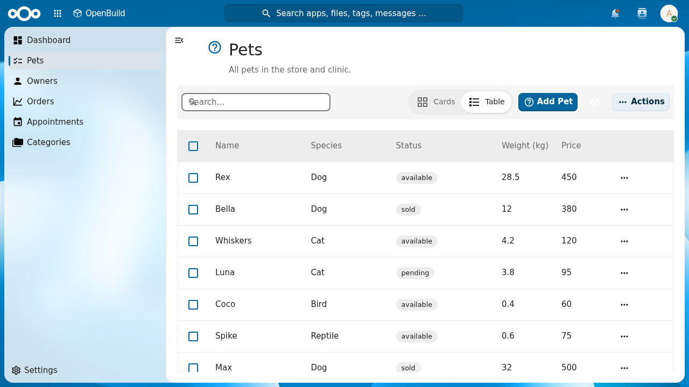
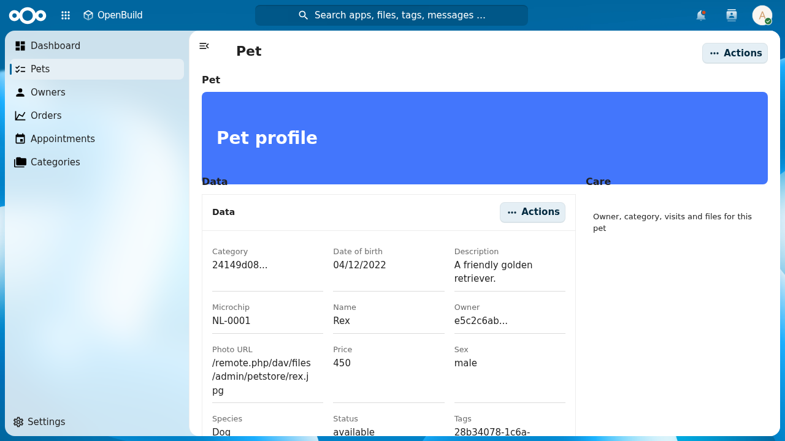
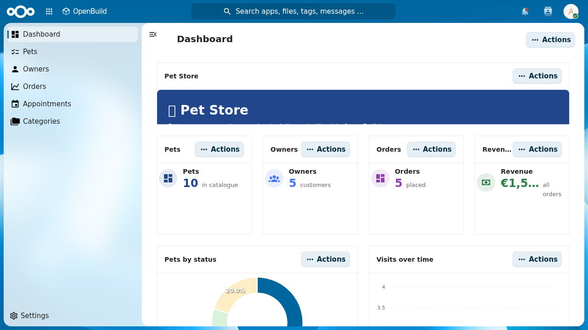

import {
  Outcomes,
  Outcome,
  Prerequisites,
  PrerequisiteItem,
  NextSteps,
  NextStep,
  HexCard,
  Troubleshooting,
} from '@conduction/docusaurus-preset/components';

OpenBuild is the visual builder for Conduction apps. The [three-paths tutorial](/academy/build-an-app-tutorial-0-three-paths) teaches the manifest path by hand: you write `manifest.json` and the `Cn*` components render it. OpenBuild builds that exact same manifest for you through a UI. You point and click, OpenBuild writes the manifest and the OpenRegister schemas behind it, and you get a working Nextcloud app with no repository, no build step, and no deploy.

This tutorial builds a **Pet Store with a veterinary layer**, the canonical Conduction sample domain. By the end you have an app your whole organisation can open: a dashboard of live numbers and charts, browsable lists of pets and owners, a rich pet profile page, a vets-only medical section, a released production version, a widget on everyone's LaunchPad, vet appointments in Nextcloud Calendar, and photos attached to each pet. Everything in this tutorial is built in the OpenBuild UI against a real OpenRegister behind it.

{/* truncate */}

<Outcomes title="What you'll have at the end">
  <Outcome>A working <strong>Pet Store app</strong> in OpenBuild with its own paw icon, seven schemas, and real relations between them.</Outcome>
  <Outcome>A <strong>dashboard that uses every widget type</strong> OpenBuild offers (header, stats, charts, gauge, delta, object list, image, label, text) bound to live register data.</Outcome>
  <Outcome>A <strong>vets-only medical layer</strong>: a Nextcloud group that alone can read the medical records, enforced by OpenRegister, not by hiding a menu.</Outcome>
  <Outcome>A <strong>released production version</strong> you can iterate on safely, plus the app surfaced on the <strong>LaunchPad dashboard</strong>, in <strong>Calendar</strong> (vet visits), and on each pet's <strong>file drop zone</strong>.</Outcome>
</Outcomes>

<Prerequisites title="What you need">
  <PrerequisiteItem>A Nextcloud instance with <strong>OpenBuild</strong> and <strong>OpenRegister</strong> enabled. Docker Compose from the OpenRegister dev environment is fine.</PrerequisiteItem>
  <PrerequisiteItem>Admin rights on that instance. You will create a group and two users for the permissions step.</PrerequisiteItem>
  <PrerequisiteItem>No coding. If you have read the <a href="/academy/build-an-app-tutorial-0-three-paths">three-paths tutorial</a> you will recognise the manifest concepts, but it is not required.</PrerequisiteItem>
</Prerequisites>

:::tip Recommended first
If you want to understand what OpenBuild is writing for you under the hood, skim [Part 0: three paths](/academy/build-an-app-tutorial-0-three-paths) first. It explains the manifest and the `nextcloud-vue` component library that OpenBuild drives.
:::

## Step 1: Create the app and give it a paw

Open **OpenBuild** from the Nextcloud app menu and choose **Create app**. Give it a name (`Pet Store`), a short description, and pick **Virtual** as the type. A virtual app lives entirely in OpenBuild; it has no installed Nextcloud counterpart.

Once the app exists, open its settings and upload an **icon**. A pet store wants a paw. Drop a 24x24 SVG into the light icon slot (and a white version into the dark slot for dark themes). OpenBuild stores the icon against the app and serves it at `/apps/openbuild/icons/pet-store.svg`.

**Verify:** the app appears in the OpenBuild app list with its paw, and opening it shows an empty shell with your app name in the navigation.

<HexCard title="What just happened">
  OpenBuild created an <code>Application</code> object plus a first <code>ApplicationVersion</code> in OpenRegister. The version holds the manifest you are about to fill in. The icon is a file attached to the application object, the same file mechanism you will use for pet photos in Step 9.
</HexCard>

## Step 2: Design the data model

A Pet Store needs more than pets. Open the **schemas** area of your app and create these seven schemas. For each one, add the properties listed, then add the relations.

| Schema | Key properties | Relations |
|---|---|---|
| `pet` | name, species, status, sex, dateOfBirth, weightKg, microchip, price, photoUrl, description | owner (to `owner`), category (to `category`), tags (to `tag`, many) |
| `owner` | firstName, lastName, email, phone, address, city | pets (to `pet`, many) |
| `category` | name, icon, description | |
| `tag` | name, color | |
| `order` | orderNumber, quantity, shipDate, status, total, complete | pet (to `pet`), customer (to `owner`) |
| `visit` | date, reason, vet, status, cost | pet (to `pet`), medicalRecord (to `medicalRecord`) |
| `medicalRecord` | date, diagnosis, treatment, notes, weightKg | pet (to `pet`), visit (to `visit`) |

A relation property is a `string` with `format: uuid` and an `x-openregister-relation` marker pointing at the target schema. OpenBuild's schema editor adds that for you when you pick "relation" as the property type and choose the target.

:::warning Watch out for slug collisions
OpenRegister resolves a schema by the lower-cased slug. `order` and `category` are common slugs that may already exist in another app on your instance. If your `order` page shows the wrong fields, your schema collided with a global one. Reference the schema by its numeric id in the page configuration, or give the pet-store schema a unique slug like `petorder`.
:::

**Verify:** all seven schemas show in the schema list, and the `pet` schema lists `owner`, `category`, and `tags` as relations.

## Step 3: Seed rich demo data

An empty app is hard to judge. Add real-looking content so your dashboard and lists have something to show. Through the app's index pages (Step 4) or the OpenRegister object API, create roughly:

- **4 categories** (Dogs, Cats, Birds, Reptiles) and **5 tags** (Friendly, Vaccinated, Neutered, Senior, Puppy).
- **5 owners** with names, emails, and cities.
- **10 pets** across the species, each with a status (`available`, `sold`, `pending`), a price, a weight, and an owner, category, and tags.
- **5 orders** with totals and ship dates, each linked to a pet and a customer.
- **6 vet visits** with reasons, vets, costs, and statuses, linked to pets.
- **5 medical records** linked to pets and visits.

Good demo data has variety: a sold beagle, an available parakeet, a pending kitten, a cancelled skin-allergy visit. Variety is what makes the charts in Step 5 worth looking at.

<HexCard title="Pet photos are files, and Nextcloud blocks external images">
  Nextcloud's content-security policy only loads images from the instance itself (<code>img-src 'self' data: blob:</code>). A photo URL pointing at an external stock-photo site will not render. Upload the photos into Nextcloud Files (or attach them to the pet, Step 9) and point <code>photoUrl</code> at the same-origin path. This is a real constraint, not an OpenBuild limitation.
</HexCard>

**Verify:** the OpenRegister object count for `pet` reads 10, and a pet object has its `owner`, `category`, and `tags` filled with the UUIDs of the objects you created.

## Step 4: Build the lists and a rich detail page

Now give the app pages. In the **pages** area, add an **index page** for each schema you want browsable: Pets, Owners, Orders, Appointments (the `visit` schema), Categories. For each index page pick the register, the schema, and the columns to show. The Pets list, for example, shows name, species, status, weight, and price.

Add the index pages to the **menu** so they appear in the left navigation, in the order you want.

Then build the **Pet detail page**. This is where OpenBuild shines: a detail page is a small grid of widgets bound to one object. For the pet profile, place:

- a **header** banner across the top,
- a **data** widget showing the pet's properties,
- a **files** widget so staff can drop documents and photos on the pet,
- a **related** widget that gathers everything linked to the pet (its owner, its category, its visits and orders).

<figure>
  
  <figcaption>The Pets index page. Columns, search, status badges, and the card/table toggle all come from the schema; you configured none of them by hand.</figcaption>
</figure>

<figure>
  
  <figcaption>Rex's profile: a header, a data grid, and the Files and Related widgets below it.</figcaption>
</figure>

**Verify:** clicking a pet in the Pets list opens its detail page with the header, the property grid, and the Files and Related sections visible.

## Step 5: Compose a dashboard from every widget

Add a **dashboard** page and set it as the app's home. A dashboard is a free grid you fill with widgets. Use the full set so the store has a real cockpit:

<HexCard title="The OpenBuild widget palette">
  <strong>Header</strong> for a titled banner. <strong>Stat</strong> cards for single numbers (pets in catalogue, owners, orders, revenue). <strong>Chart</strong> for distributions and trends (pets by status as a donut, visits over time as a line). <strong>Gauge</strong> for a value against a target (pets sold out of ten). <strong>Delta</strong> for a number with its change. <strong>Stats block</strong> for a labelled count (available pets). <strong>Object list</strong> for a live mini-table (recent pets). <strong>Image</strong>, <strong>label</strong>, and <strong>text</strong> for framing and copy.
</HexCard>

Each data widget asks for a register, a schema, and a metric. A revenue stat is `metric: sum` over the `order` schema's `total` field. A "pets by status" donut groups the `pet` schema by its `status` field. A gauge for pets sold counts `pet` where `status = sold` against a static target. None of this is code; it is a form per widget.

<figure>
  
  <figcaption>The dashboard: header, four KPI cards, a status donut, and a visits-over-time line, all bound to live data.</figcaption>
</figure>

:::tip Charts have two modes
A chart is either **over time** (pick a date field and an interval, like visits per month) or **by category** (pick a field to group by, like pets per status). Choose the mode that matches the question you are answering.
:::

**Verify:** open the app. The dashboard shows real numbers (Pets 10, Owners 5, Orders 5, a non-zero Revenue) and the donut renders coloured segments for each status.

## Step 6: Give the vets their own medical layer

The medical records are sensitive. Only a **vets** group should read them, and only vets should see the medical part of the app. The important rule: hiding a menu is not security. The data itself must be protected.

First, the data. As admin, create a Nextcloud group `vets` and put your veterinary users in it. Then open the `medicalRecord` schema's **permissions** and set the read (and create, update, delete) groups to `vets`. OpenRegister now enforces this on every request: a user in `vets` reads medical records, a user outside it reads none, and admins keep full access.

**Verify it for real.** Create one user in `vets` and one outside it, then read the medical records as each:

```bash
# A vet sees the medical records
curl -u vetuser:'<password>' -H 'OCS-APIRequest: true' \
  "https://<host>/apps/openregister/api/objects/<register>/medicalRecord" | jq '.total'
# -> 5

# A non-vet sees none of them
curl -u petstaff:'<password>' -H 'OCS-APIRequest: true' \
  "https://<host>/apps/openregister/api/objects/<register>/medicalRecord" | jq '.total'
# -> 0
```

With the data locked down, you can now scope the **navigation**: tag the medical menu item (and an optional vet dashboard page) so the app only shows them to the `vets` group. The menu scoping is the presentation layer; the OpenRegister permission above is the wall.

<Troubleshooting>
  <p><strong>The non-vet user also sees zero pets, not just zero medical records.</strong> That is tenant isolation, a separate OpenRegister control: a user only sees objects in an organisation they belong to. Add both users to the app's organisation so the only difference between them is the medical permission.</p>
</Troubleshooting>

## Step 7: Release a production version

You have been building in the open. Before colleagues rely on the app, cut a **production version** so you can keep editing without changing what they see.

OpenBuild versions an app the way OpenRegister versions any object. Open the app's **version history**. The version you have been editing is the draft. Use **release** to mark it as production. From now on there is exactly one production version at a time; "Open app" always opens that one.

To keep working, open a non-production version from the version list and edit there. Your colleagues stay on production until you release again. This is how you separate development from what is live, without a second instance.

**Verify:** the version history shows one version marked as production, and opening the app from the app list lands on it.

## Step 8: Put the store on everyone's LaunchPad

LaunchPad is the personal Nextcloud dashboard. Surface the Pet Store there so it is one glance away. Open LaunchPad, choose **Add custom widget**, pick **Object list**, and point it at the Pet Store production register and the `pet` schema. Add columns for name, species, and status, give it a title, and save.

<HexCard title="Why this works without glue code">
  LaunchPad's widgets read OpenRegister live at runtime. You give it a register and a schema as plain text, it fetches and renders. The same data your OpenBuild app shows is now on the personal dashboard, with no integration to build.
</HexCard>

**Verify:** the LaunchPad widget lists your pets with their species and status, and updates when you add a pet.

## Step 9: Find pets in search, link visits to Calendar, drop files on a pet

Three Nextcloud-native touches finish the app. Each one is a small piece of configuration that hands you a platform feature.

**Search.** In each schema you want findable, turn on the **searchable** flag. OpenRegister exposes those objects to Nextcloud's unified search through one fleet-wide provider, so a pet becomes a result in the top-bar magnifier next to files and messages. You write no search code.

**Calendar (the leaf).** A vet appointment is an event, so it belongs in Calendar. Link each `visit` to a Nextcloud Calendar event:

```bash
curl -u admin:admin -H 'OCS-APIRequest: true' \
  -X POST "https://<host>/apps/openregister/api/objects/<register>/visit/<visitId>/events" \
  -H 'Content-Type: application/json' \
  -d '{"summary":"Vet visit: Annual check-up (Rex)","dtstart":"2026-06-01T09:30:00","dtend":"2026-06-01T10:00:00","location":"Pet Store Clinic"}'
```

The visit now appears in the user's Calendar, and the **Related** widget on the visit's detail page lists the appointment. Calendar is the right leaf for an event, the same way knowledge belongs in a wiki and tasks belong in Deck.

**Files.** A pet's detail page carries a **Files** widget. Drop a photo or a vaccination certificate on it and the file attaches to that pet's object in OpenRegister, stored in Nextcloud Files. The data widget keeps the structured fields; the file widget keeps the documents.

**Verify:** searching a pet's name returns it; a vet visit shows in Calendar; a file dropped on a pet appears in that pet's file list.

## Test yourself

You have built the app if all of these are true:

- Opening the Pet Store shows a dashboard with live numbers and a status donut.
- The Pets list is browsable and a pet's profile shows its data, files, and related objects.
- A user in `vets` reads the medical records; a user outside it reads none.
- The version history shows one production version.
- The Pet Store widget shows pets on your LaunchPad, a vet visit shows in Calendar, and a file dropped on a pet sticks.

## Where to go from here

<NextSteps>
  <NextStep href="/academy/build-an-app-tutorial-0-three-paths">See the manifest OpenBuild wrote for you. Part 0 of the code path explains the same app built by hand, so you can read your own app's JSON.</NextStep>
  <NextStep href="https://openbuild.conduction.nl/docs/widgets/">Browse the full widget reference to push your dashboard and detail pages further.</NextStep>
  <NextStep>Rebuild your own domain. Swap pets for cases, products, or requests; the seven-schema, dashboard, permissions, release shape is the same for any register-backed app.</NextStep>
</NextSteps>
