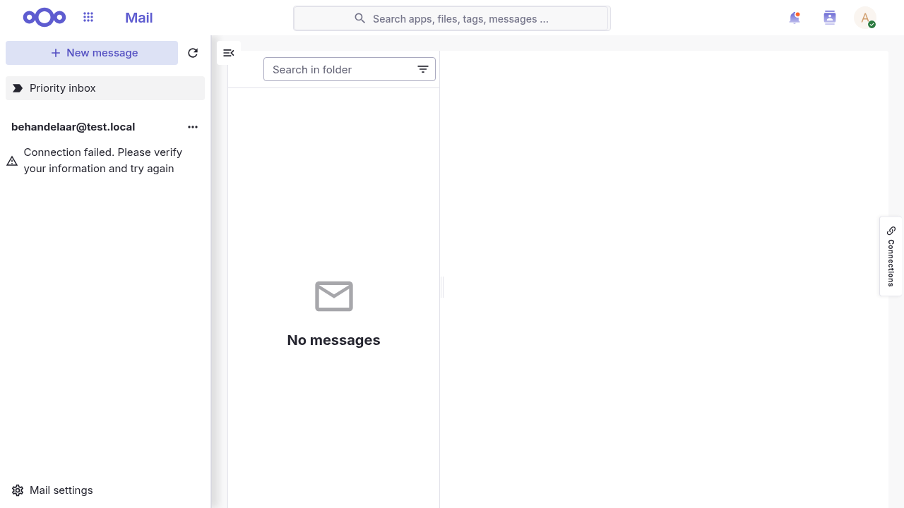

import {
  PullQuote,
  AppCrossLinks,
} from '@conduction/docusaurus-preset/components';

The French, the Germans and the Dutch are each building their own sovereign workspace. [La Suite](https://lasuite.numerique.gouv.fr/en) is beautiful, as ever. [openDesk](https://www.opendesk.eu/en) is well engineered and gloriously feature rich. [MijnBureau](https://minbzk.github.io/mijn-bureau/) ties the best of both together, because of course it does.

So we borrowed a method from Dr Frankenstein. Take the guillotine to the French design, apply the Dutch instinct for stitching things together, and graft the result onto German engineering.

Introducing La Frankendesk: a best-of-breed open workspace that adds no new portal. No repositories were harmed in the making of it.

{/* truncate */}

The screenshot above is Nextcloud. So far nobody has guessed that on the first try.

The typography is La Suite's. So are the violet, the flat surfaces, the four-pixel corners, and the active rows with no coloured rail down the left. Underneath it is a stock Nextcloud 34 with one extra app switched on. No fork. No patch set. No new applications.

That took one working session. The useful part is which half was hard, and it was not the half I expected.

## Europe is building the same suite three times

The Germans have openDesk, built by ZenDiS for the Federal Ministry of the Interior. It launched in October 2024 and was used a week later at the Conference of Minister Presidents in Leipzig, coordinating material across all sixteen Länder. In October 2025 the International Criminal Court confirmed it is replacing Microsoft Office with openDesk.

The French have La Suite numérique, run by DINUM. Its total cost for 2026 is estimated at twelve million euros, about four million of which is billed back to the ministries that use it.

The Dutch have MijnBureau, from BZK.

Three programmes. Three roadmaps. Three of everything.

Except they are not three, and that is the part worth writing about. Open the component lists side by side and the same names keep coming back. Nextcloud. Element. Collabora. OpenProject. The parts bin is already shared. What is not shared is the finish.

**Why now, and why the ICC matters.** The Court's move followed a period in which its Chief Prosecutor, Karim Khan, reportedly lost access to his Microsoft email account after the February 2025 executive order. Microsoft's president Brad Smith denied the company had cut anything off, stating that at no point did Microsoft cease or suspend its services to the ICC.

Both of those things can be true at once, and that is exactly the point. The dependency does not have to be exercised to be felt. An institution that cannot answer the question "what happens if" has already learned something about where it stands.

## Three answers to the same question

Three programmes, three engineering strategies, and all three are defensible.

### The Germans: openDesk

#### Vision

Buy the ecosystem instead of building it. ZenDiS, a state-owned company working for the Federal Ministry of the Interior, treats sovereignty as an integration problem rather than a development one. The applications already exist and already have users; what is missing is someone to assemble, certify and carry them.

#### Architecture

Nextcloud for files, OpenProject for projects, XWiki for knowledge, Open-Xchange for mail, Element for chat, Collabora for documents, Univention for identity. Ten companies build the parts. ZenDiS integrates them and carries the distribution, under Apache-2.0, now at version 1.14.1, deployed as Kubernetes and Helm charts in the open on the Germans' own public code platform.

The reach is remarkable. You get project management and a wiki, which no office suite gives you. Seven upstreams also means seven release trains and seven design languages, so a shared interface is the one thing this model cannot hand you for free.

There is something very German about the result, and I mean that as the compliment it plainly is. The integration is the engineering. It is specified, versioned, and written down, and you get the distinct feeling that somebody has already thought about what happens when it breaks at three in the morning.

<figure className="hfaw-chart">
<svg viewBox="0 0 400 240" role="img" aria-label="Diagram: openDesk with the Nubus portal above six components from existing projects, over a Nubus identity layer">
  <text x="6" y="14" className="lbl">openDesk · ZenDiS</text>
  <text x="6" y="30" className="lbl2">integrates what already exists</text>
  <rect x="6" y="40" width="386" height="28" rx="4" className="bxn" /><text x="199" y="59" textAnchor="middle" className="bxl">Nubus portal · one tile per app</text>
  <rect x="6" y="76" width="92" height="40" rx="4" className="bx" /><text x="52" y="100" textAnchor="middle" className="bxl">Nextcloud</text>
  <rect x="104" y="76" width="92" height="40" rx="4" className="bx" /><text x="150" y="100" textAnchor="middle" className="bxl">OpenProject</text>
  <rect x="202" y="76" width="92" height="40" rx="4" className="bx" /><text x="248" y="100" textAnchor="middle" className="bxl">XWiki</text>
  <rect x="300" y="76" width="92" height="40" rx="4" className="bx" /><text x="346" y="100" textAnchor="middle" className="bxl">Element</text>
  <rect x="6" y="124" width="92" height="40" rx="4" className="bx" /><text x="52" y="148" textAnchor="middle" className="bxl">Open-Xchange</text>
  <rect x="104" y="124" width="92" height="40" rx="4" className="bx" /><text x="150" y="148" textAnchor="middle" className="bxl">Collabora</text>
  <rect x="6" y="172" width="386" height="28" rx="4" className="bxn" /><text x="199" y="191" textAnchor="middle" className="bxl">Univention Nubus · identity</text>
  <text x="6" y="224" className="lbl2">ten companies build · seven design languages</text>
</svg>
<figcaption>Blue marks a component that came from an existing project.</figcaption>
</figure>

#### Portal

The [Nubus portal](https://www.univention.com/references/zentrum-fuer-digitale-souveraenitaet/), also from Univention, is the page you meet after signing in: a grid of tiles showing only the applications you have rights to. It is a good portal, and it is honest about what it is in a way that turns out to matter. In openDesk's own description, clicking a tile opens that service in a new tab.

So the portal is a place you leave. You land there, choose, and depart into an application that looks like itself rather than like the suite.

<figure className="hfaw-chart">
<svg viewBox="0 0 240 175" role="img" aria-label="openDesk's Nubus portal: a bar of tiles above four apps, with an arrow leaving a tile to open a new tab">
  <defs>
    <marker id="ahD" markerWidth="6" markerHeight="6" refX="5" refY="3" orient="auto">
      <path d="M0,0 L6,3 L0,6 z" fill="var(--ifm-color-emphasis-600)" />
    </marker>
  </defs>
  <text x="6" y="14" className="pnl">openDesk</text>
  <text x="6" y="28" className="pnl2">you land, then leave</text>
  <rect x="6" y="36" width="228" height="26" rx="3" className="bxn" /><text x="120" y="53" textAnchor="middle" className="bxs">Nubus portal</text>
  <rect x="6" y="74" width="110" height="28" rx="3" className="bx" /><text x="61" y="92" textAnchor="middle" className="bxs">app</text>
  <rect x="124" y="74" width="110" height="28" rx="3" className="bx" /><text x="179" y="92" textAnchor="middle" className="bxs">app</text>
  <rect x="6" y="110" width="110" height="28" rx="3" className="bx" /><text x="61" y="128" textAnchor="middle" className="bxs">app</text>
  <rect x="124" y="110" width="110" height="28" rx="3" className="bx" /><text x="179" y="128" textAnchor="middle" className="bxs">app</text>
  <path d="M179 110 L179 68" className="arw" markerEnd="url(#ahD)" />
  <text x="6" y="160" className="pnl2">a tile opens its service in a new tab</text>
</svg>
<figcaption>A launcher you leave.</figcaption>
</figure>

### The French: La Suite

#### Vision

Own the product, not just the licence. DINUM builds its own applications rather than assembling them, which buys total control over how the thing feels and costs the ability to inherit anyone else's work. Sovereignty as authorship.

#### Architecture

Docs, Messages, Visio, Drive, and Tchap, the state's secure messaging platform, which is used by more than 600,000 agents. All of it on DINUM's own design system, called Cunningham.

Note where that design system sits in the diagram. It is not a component alongside the others. It is the layer they are all drawn on, which is precisely why the result feels coherent and why it is the thing worth borrowing. Fewer parts, and every one of them wearing the same face. Writing everything yourself also means the shelf holds only what you have written, so a wiki and project tooling are not on it.

And it is, unmistakably, French. It is beautiful, and it is beautiful on purpose, which is the part engineers tend to underrate. Somebody sat down and decided what the spacing should be. That is why we spent a session porting their design language rather than the other way round.

<figure className="hfaw-chart">
<svg viewBox="0 0 400 210" role="img" aria-label="Diagram: La Suite with the Cunningham design system above four components DINUM built itself, the Gaufre waffle embedded in each, over a Keycloak identity layer">
  <text x="6" y="14" className="lbl">La Suite numérique · DINUM</text>
  <text x="6" y="30" className="lbl2">builds its own</text>
  <rect x="6" y="40" width="386" height="30" rx="4" className="bx2" /><text x="199" y="60" textAnchor="middle" className="bxl">Cunningham design system</text>
  <rect x="6" y="78" width="92" height="40" rx="4" className="bx2" /><text x="52" y="102" textAnchor="middle" className="bxl">Docs</text>
  <rect x="104" y="78" width="92" height="40" rx="4" className="bx2" /><text x="150" y="102" textAnchor="middle" className="bxl">Messages</text>
  <rect x="202" y="78" width="92" height="40" rx="4" className="bx2" /><text x="248" y="102" textAnchor="middle" className="bxl">Visio</text>
  <rect x="300" y="78" width="92" height="40" rx="4" className="bx2" /><text x="346" y="102" textAnchor="middle" className="bxl">Drive</text>
  <rect x="84" y="84" width="10" height="10" rx="2" fill="#fff" opacity="0.85" />
  <rect x="182" y="84" width="10" height="10" rx="2" fill="#fff" opacity="0.85" />
  <rect x="280" y="84" width="10" height="10" rx="2" fill="#fff" opacity="0.85" />
  <rect x="378" y="84" width="10" height="10" rx="2" fill="#fff" opacity="0.85" />
  <rect x="6" y="126" width="386" height="28" rx="4" className="bxn" /><text x="199" y="145" textAnchor="middle" className="bxl">Keycloak · identity</text>
  <text x="6" y="176" className="lbl2">the design system sits above, not beside</text>
  <text x="6" y="192" className="lbl2">La Gaufre (▫) rides inside every app, not over them</text>
</svg>
<figcaption>Violet marks a component La Suite built itself.</figcaption>
</figure>

#### Portal

There isn't one, and that is the interesting part. [La Gaufre](https://integration.lasuite.numerique.gouv.fr/guides/gaufre-v2/), the waffle, is a button that lives *inside* every La Suite application, opening a menu of the others. Version two loads its list of services as JSON from an API, aligns with La Suite's UI Kit, and wraps itself in Shadow DOM so its styling stays independent of whatever page it is embedded in.

You never land on a hub, because the hub travels with you. It is the closest of the three to integration, and the Shadow DOM is the tell: the widget has to wall itself off from the page it is standing in.

<figure className="hfaw-chart">
<svg viewBox="0 0 240 175" role="img" aria-label="La Suite's Gaufre: a waffle button embedded inside each of four applications rather than a separate portal">
  <text x="6" y="14" className="pnl">La Suite</text>
  <text x="6" y="28" className="pnl2">it travels with you</text>
  <rect x="6" y="40" width="110" height="44" rx="3" className="bx2" /><text x="61" y="66" textAnchor="middle" className="bxs">app</text>
  <rect x="100" y="46" width="10" height="10" rx="2" fill="#fff" opacity="0.9" />
  <rect x="124" y="40" width="110" height="44" rx="3" className="bx2" /><text x="179" y="66" textAnchor="middle" className="bxs">app</text>
  <rect x="218" y="46" width="10" height="10" rx="2" fill="#fff" opacity="0.9" />
  <rect x="6" y="92" width="110" height="44" rx="3" className="bx2" /><text x="61" y="118" textAnchor="middle" className="bxs">app</text>
  <rect x="100" y="98" width="10" height="10" rx="2" fill="#fff" opacity="0.9" />
  <rect x="124" y="92" width="110" height="44" rx="3" className="bx2" /><text x="179" y="118" textAnchor="middle" className="bxs">app</text>
  <rect x="218" y="98" width="10" height="10" rx="2" fill="#fff" opacity="0.9" />
  <text x="6" y="158" className="pnl2">the waffle sits inside each app,</text>
  <text x="6" y="170" className="pnl2">walled off by Shadow DOM</text>
</svg>
<figcaption>A switcher that rides along.</figcaption>
</figure>

### The Dutch: MijnBureau

#### Vision

Faced with two excellent options, the Dutch declined to pick one. It took both, put a dashboard on top, and went looking for the middle ground, which is the most Dutch response available and, this time, exactly the right one. We [polder](https://en.wikipedia.org/wiki/Polder_model) our architecture the way we polder everything else: get everyone around the table and keep talking until nobody has to lose. Usually that produces a compromise nobody loves. Occasionally it produces MijnBureau.

#### Architecture

Read its component list. Keycloak, Element, Nextcloud, Collabora, OpenProject. Then Docs, Visio, Conversations, Drive. The first group is openDesk's parts bin. The second group is La Suite's. One deployment, both bins, and BZK writing very little proprietary code of its own. Its own repository describes it plainly as an integration layer, inspired by openDesk and La Suite.

That is Common Ground applied to the workplace, and it works. It is also the quiet refutation of the whole islands framing. You cannot be looking at three isolated programmes when one of them runs the other two's components in production.

It is worth being precise about what the three programmes say themselves, because a lot gets said on their behalf. MijnBureau describes close collaboration with France around La Suite and alignment with Germany's openDesk. That is knowledge exchange between teams who talk to each other, and it is genuinely valuable. The stronger claim you will read in write-ups, that a German civil servant on openDesk can already co-edit a document with a French colleague on La Suite, does not appear in any of the three programmes' own sources. It is a story told about these programmes more than by them.

<figure className="hfaw-chart">
<svg viewBox="0 0 400 250" role="img" aria-label="Diagram: MijnBureau as a portal over components from both openDesk and La Suite, with Keycloak identity underneath">
  <text x="6" y="14" className="lbl">MijnBureau · BZK</text>
  <text x="6" y="30" className="lbl2">combines both parts bins</text>
  <rect x="6" y="40" width="386" height="30" rx="4" className="bxn" /><text x="199" y="60" textAnchor="middle" className="bxl">Bureaublad · dashboard that aggregates the parts</text>
  <rect x="6" y="78" width="92" height="40" rx="4" className="bx" /><text x="52" y="102" textAnchor="middle" className="bxl">Nextcloud</text>
  <rect x="104" y="78" width="92" height="40" rx="4" className="bx" /><text x="150" y="102" textAnchor="middle" className="bxl">OpenProject</text>
  <rect x="202" y="78" width="92" height="40" rx="4" className="bx" /><text x="248" y="102" textAnchor="middle" className="bxl">Element</text>
  <rect x="300" y="78" width="92" height="40" rx="4" className="bx" /><text x="346" y="102" textAnchor="middle" className="bxl">Collabora</text>
  <rect x="6" y="126" width="92" height="40" rx="4" className="bx2" /><text x="52" y="150" textAnchor="middle" className="bxl">Docs</text>
  <rect x="104" y="126" width="92" height="40" rx="4" className="bx2" /><text x="150" y="150" textAnchor="middle" className="bxl">Visio</text>
  <rect x="202" y="126" width="92" height="40" rx="4" className="bx2" /><text x="248" y="150" textAnchor="middle" className="bxl">Conversations</text>
  <rect x="300" y="126" width="92" height="40" rx="4" className="bx2" /><text x="346" y="150" textAnchor="middle" className="bxl">Drive</text>
  <rect x="6" y="174" width="386" height="30" rx="4" className="bxn" /><text x="199" y="194" textAnchor="middle" className="bxl">Keycloak · identity</text>
  <text x="6" y="226" className="lbl2">two colours, one deployment</text>
  <text x="6" y="242" className="lbl2">each app still keeps its own face</text>
</svg>
<figcaption>The bill of materials is the argument. Nobody calls this a merge.</figcaption>
</figure>

#### Portal

[Bureaublad](https://minbzk.github.io/mijn-bureau-infra/docs/components/bureaublad) is the most ambitious of the three, because it is not a launcher. A FastAPI backend and a React frontend *aggregate information out of the underlying components* into one interface, so you can reach tools and data without switching applications at all. There is a [separate portal repository](https://github.com/MinBZK/mijn-bureau-portal) alongside it.

Note the direction of the arrows. Everywhere else the portal sends you somewhere; here the work is pulled toward you. This one tries to dissolve the boundary rather than decorate it.

<figure className="hfaw-chart">
<svg viewBox="0 0 240 175" role="img" aria-label="MijnBureau's Bureaublad: a dashboard that aggregates information inward from components of both origins">
  <defs>
    <marker id="ahN" markerWidth="6" markerHeight="6" refX="5" refY="3" orient="auto">
      <path d="M0,0 L6,3 L0,6 z" fill="var(--ifm-color-emphasis-600)" />
    </marker>
  </defs>
  <text x="6" y="14" className="pnl">MijnBureau</text>
  <text x="6" y="28" className="pnl2">the work comes to you</text>
  <rect x="6" y="36" width="228" height="42" rx="3" className="bxn" /><text x="120" y="61" textAnchor="middle" className="bxs">Bureaublad</text>
  <rect x="6" y="112" width="110" height="28" rx="3" className="bx" /><text x="61" y="130" textAnchor="middle" className="bxs">component</text>
  <rect x="124" y="112" width="110" height="28" rx="3" className="bx2" /><text x="179" y="130" textAnchor="middle" className="bxs">component</text>
  <path d="M61 110 L61 84" className="arw" markerEnd="url(#ahN)" />
  <path d="M179 110 L179 84" className="arw" markerEnd="url(#ahN)" />
  <text x="6" y="162" className="pnl2">data is aggregated into one interface</text>
</svg>
<figcaption>A dashboard that pulls inward.</figcaption>
</figure>

Each choice bought something real, and each left something on the table that another one has. openDesk has the ecosystem and wants the finish. La Suite has the finish and wants the ecosystem. MijnBureau has both parts bins, which is further than anyone else has gone.

### Three portals, one wall

All three hit the same wall. Once a suite is assembled from separate applications, something has to tie them together for the person using them, and the three answers above are a map of the whole problem: a launcher you leave, a dashboard that pulls inward, and a switcher that rides along.

Read that Shadow DOM clause again, because it is the whole post in one engineering decision. La Gaufre has to defend itself from the host page's CSS. It cannot assume the application it is sitting inside looks anything like La Suite, so it builds a wall around its own appearance. The widget that exists to make a suite feel like one product has to be isolated from the products it connects.

None of the three is wrong. Each is a sensible answer to a real problem, and Bureaublad in particular is doing something genuinely harder than the others. But notice what none of them can do. A portal, a dashboard and a waffle all make the border easier to cross. The border is still there, because each application still arrives wearing its own face. The parts bin is shared. The finish is still three finishes.

<PullQuote>The parts bin is already shared. The only thing still built three times is the part you can see.</PullQuote>

## The merge is one app, and nothing is forked

So we went one rung further. Not a layer that combines applications, but an integration. Take La Suite's design language and port it onto the components. No new applications at all.

The work lives in a single Nextcloud app, nldesign, as a token set called lasuite. Installing the app is the whole deployment. Four stylesheets load in order, and each has exactly one job.

The first is generated directly from `@openfun/cunningham-tokens`, which is La Suite's own published design system. We do not copy their values by hand. We build from the same package they build from, so when they move, we move.

The second is a generated delta of 331 colour tokens, taken from La Suite's deployed CSS. Generated, not written. A human maintaining 331 colours by hand is a human introducing drift.

The third is the actual translation layer, and it is the interesting one. It maps roughly 68 Nextcloud `--color-*` variables onto La Suite tokens. Nextcloud already describes its entire surface in variables, so almost the whole theme is that one file. People find that surprising, and it is the single best argument for the approach.

The fourth reaches Nextcloud's own selectors for the handful of things a variable cannot express. Whether an active row carries a coloured rail down its left edge is not a colour. It is a shape.

That is it. No fork, no patch set, no new applications. The reason this matters is not elegance. A fork is a permanent maintenance bill and a theme is not. Nextcloud ships a release and the theme keeps working.

<figure className="hfaw-chart">
<svg viewBox="0 0 400 280" role="img" aria-label="Diagram: La Frankendesk, one finish drawn over components from both ecosystems, with an OpenConext federation hub above Keycloak and Entra, and OpenRegister federation">
  <text x="6" y="14" className="lbl">La Frankendesk</text>
  <text x="6" y="30" className="lbl2">one finish, mixed parts, no new apps</text>
  <rect x="6" y="40" width="386" height="30" rx="4" className="bx2" /><text x="199" y="60" textAnchor="middle" className="bxl">La Suite design language · one finish for all of it</text>
  <rect x="6" y="78" width="92" height="40" rx="4" className="bx" /><text x="52" y="102" textAnchor="middle" className="bxl">Nextcloud</text>
  <rect x="104" y="78" width="92" height="40" rx="4" className="bx" /><text x="150" y="102" textAnchor="middle" className="bxl">OpenProject</text>
  <rect x="202" y="78" width="92" height="40" rx="4" className="bx" /><text x="248" y="102" textAnchor="middle" className="bxl">Matrix</text>
  <rect x="300" y="78" width="92" height="40" rx="4" className="bx" /><text x="346" y="102" textAnchor="middle" className="bxl">Euro-Office</text>
  <rect x="6" y="126" width="92" height="40" rx="4" className="bx" /><text x="52" y="150" textAnchor="middle" className="bxl">XWiki</text>
  <rect x="104" y="126" width="190" height="40" rx="4" className="bx2" /><text x="199" y="150" textAnchor="middle" className="bxl">La Suite Messages</text>
  <rect x="300" y="126" width="92" height="40" rx="4" className="bx2" /><text x="346" y="150" textAnchor="middle" className="bxl">Docs</text>
  <rect x="6" y="174" width="190" height="28" rx="4" className="bxn" /><text x="101" y="193" textAnchor="middle" className="bxl">OpenConext · federation hub</text>
  <rect x="202" y="174" width="190" height="28" rx="4" className="bxn" /><text x="297" y="193" textAnchor="middle" className="bxl">OpenRegister · OCM</text>
  <rect x="6" y="208" width="92" height="24" rx="4" className="bxg" /><text x="52" y="224" textAnchor="middle" className="bxgl">Keycloak</text>
  <rect x="104" y="208" width="92" height="24" rx="4" className="bxg" /><text x="150" y="224" textAnchor="middle" className="bxgl">Entra ID</text>
  <text x="202" y="224" className="lbl2">files · data · configuration</text>
  <text x="6" y="254" className="lbl2">the hub sits above whatever you run today</text>
  <text x="6" y="270" className="lbl2">both parts bins, both colours, one finish</text>
</svg>
<figcaption>Not a portal over the parts. One finish drawn across them.</figcaption>
</figure>

**The most portable thing we learned.** La Suite's dark theme does not invert its ramp. `gray-000` is still `#fff` inside `.cunningham-theme--dark`. What moves is the contextual layer, so `surface--primary` becomes `gray-800`, `secondary` becomes `gray-850`, and `tertiary` becomes `gray-900`. The lesson generalises well past this merge. Any theme that hardcodes ramp steps cannot be made dark-capable later, and nobody finds that out until the day someone asks for dark mode.

### The one box we added

Put the four diagrams side by side and notice how little actually changed. Nextcloud, OpenProject, Matrix, XWiki, Collabora, Docs, Messages: every component came out of one of the three programmes. We wrote no applications.

There is exactly one box we added, and it is the identity layer. openDesk fronts its stack with Univention. La Suite uses Keycloak, and so does MijnBureau. We put OpenConext above ours. That is the only choice in this whole architecture that differs from what openDesk, La Suite and MijnBureau do between them.

The word above is doing the work. OpenConext is a federation hub, not an identity store, so it does not replace anything. It brokers over open standards, which means one connection can front a Keycloak realm and a Microsoft Entra tenant at the same time. Keycloak stays. Entra stays, for now. The applications stop caring which is which.

That is what makes the stack independent of its auth provider, and independence here is not a slogan. Today most Dutch public bodies sign in through Entra. Telling them to rip it out is how a sovereignty project dies in its first meeting. Put a hub in front and the question changes shape: the migration happens behind the door rather than at it, one directory at a time, with nothing above the hub needing to know it happened. A vision of leaving Entra is worth very little without a route that does not begin with a big bang. This is that route.

The software is not exotic either. OpenConext is open source, built by SURF, the ICT cooperative of Dutch education and research. SURF runs it for education as SURFconext, connecting around 130 institutions and nearly two thousand service providers at roughly 2.5 million authentications a day. The same software runs government's own federation: central government uses it as Single Sign-On Rijk for some 240,000 users across the ministries, and the wider public sector reaches it as GovConext, where municipalities, safety regions and health organisations connect. It is the rare case where the sovereign option is also the incumbent one.

And this is where the identity layer stops being plumbing and starts being the point. Remember the federation story from earlier, the one told about these programmes more than by them. A hub is how that story gets built. If each country fronts its own stack with a broker that speaks open standards, then a Dutch civil servant reaching a German service is a trust relationship between two hubs, not a migration, not a shared user directory, and not a single European login anybody has to own. Each country keeps its own identity provider and its own rules about who is in it.

That is the same shape as everything else in this post. Not one system. A shared way of connecting the ones that exist. A shared shelf needs a shared front door, and the front door turns out to be the easier half.

**Where the code lives.** Every component in these diagrams is public, and reading the deployment repositories teaches more than any architecture diagram, including mine.

- **openDesk**. [gitlab.opencode.de/bmi/opendesk](https://gitlab.opencode.de/bmi/opendesk), Kubernetes and Helm, on Germany's public code platform
- **La Suite**. [github.com/suitenumerique](https://github.com/suitenumerique), including Docs, Messages, Visio and Drive
- **MijnBureau**. [MinBZK/mijn-bureau](https://github.com/MinBZK/mijn-bureau) for the process and [MinBZK/mijn-bureau-infra](https://github.com/MinBZK/mijn-bureau-infra) for the deployment
- **Components**. [Nextcloud](https://github.com/nextcloud), [OpenProject](https://github.com/opf/openproject), [XWiki](https://github.com/xwiki), [Element](https://github.com/element-hq), [Collabora Online](https://github.com/CollaboraOnline), [OpenConext](https://github.com/OpenConext)
- **This merge**. [nldesign](https://github.com/ConductionNL/nldesign) and [openregister](https://github.com/ConductionNL/openregister)

## The parts were never the problem

Read those four files and the merge sounds clean. It was not.

Victor Frankenstein sourced good components. What made the thing a monster was the stitching, and that turned out to be an unnervingly precise description of the work. Every component integrated. What gave it away, again and again, was the seam.

The defect has one shape, and we hit it five times. A selector that reads plausibly, lints clean, passes review, and matches nothing at all.

Nextcloud 34 renders its sidebar as `#app-navigation-vue`. We had written thirteen rules against `#app-navigation`. Twelve were inert, and the one that did match lost on specificity to a scoped `!important` inside the component library, so the active row kept its Nextcloud tint no matter what the theme said. Nextcloud emits two spellings of its tertiary button class. Our rule listed one of them, and on a single page that meant styling one button and missing sixty. Search is a button, not an input, so three rules aimed at an input did nothing. The outer shell of the page does not carry the class we thought it did, which left an eight-pixel inset and a rounded corner showing the old background like a frame around the app.

The fifth one is the one I would put on a slide. It was inside our own parity test, asserting on a header element with a comment saying it is always present in stock Nextcloud. It is not present in Nextcloud 34. That assertion had never run once. It failed on a visibility timeout and reported itself as a styling mismatch, which is the most expensive possible way to be wrong.

None of these fail loudly. That is the whole problem. A rule that matches nothing looks exactly like a rule that matches something and agrees with the default.

So we built the check. It walks every selector the stylesheet ships, loads six real surfaces, and asserts that each selector matches at least one element somewhere across them. Union semantics, because a rule for the Files grid is legitimately absent on Calendar. Anything that genuinely cannot match has to be listed with a written reason, so a dead selector becomes a decision somebody made on purpose instead of something nobody noticed. It found the sixty-buttons defect on its first capable run.

It also caught rules written that same day, by the person who built it.

<PullQuote>Not one of these was a hard problem. Every one of them was invisible, which is worse.</PullQuote>

## What it looks like

Three columns, all captured live at the same size. The reference on the left, La Frankendesk in the middle, stock Nextcloud on the right.

<figure><figcaption>La Suite Messages</figcaption></figure>
<figure><figcaption><b>La Frankendesk</b></figcaption></figure>
<figure><figcaption>Nextcloud, stock</figcaption></figure>

<figure><figcaption>La Suite Docs</figcaption></figure>
<figure><figcaption><b>La Frankendesk</b></figcaption></figure>
<figure><figcaption>Nextcloud, stock</figcaption></figure>

The before and after on a single detail says more than the wide shots. On the left, an early attempt at the header. Nextcloud ships its header glyphs in white because its own header is dark, so an early fix inverted them. Inverting a filter on a parent element rasterises everything below it, which flattened the user's avatar into a solid black disc that no child rule could rescue. Colour inherits. Filters do not un-inherit.

<figure><figcaption>The filter approach. Note the avatar.</figcaption></figure>
<figure><figcaption>Tinted by token instead.</figcaption></figure>

And it survives contact with the two things that usually break a theme. Real dark mode, and the login page, which most themes forget because it renders before the user exists.

<figure><figcaption>Dark mode, on Nextcloud's real dark theme.</figcaption></figure>
<figure><figcaption>Login, on La Suite ground.</figcaption></figure>

## What this unlocks

Start with the obvious half. Every Nextcloud app now inherits the finish. Calendar, Contacts, Talk, Deck and everything else in a very large app store arrive already wearing La Suite's design language, because they were never themed individually. They read variables, and we changed the variables. That is the ecosystem La Suite wants, available without writing any of it.

The other half is federation, and this is where I want to be careful, because the strongest argument against merging anything is a good one. Merging components creates a shared dependency nobody owns, and in government systems a monoculture is a security problem, not just an architectural preference. Sovereignty falls as your dependence on components you cannot control rises. That argument is correct.

It is also not what is being proposed here. Nothing above asks a country to give up a stack.

Nextcloud already federates natively, server to server, over Open Cloud Mesh. OpenRegister extends that same rail to structured data, by implementing Nextcloud's own cloud federation provider and advertising its own OCM resource type, so objects federate the way files already do. It also federates configuration. Flows, registers, schemas, whole configuration sets and design themes travel as portable bundles with instance identifiers stripped and secrets excluded, signed with an Ed25519 key so the receiver can verify who published what.

Which means the theme itself federates. You do not have to merge the components at all. You can federate the finish. An instance installs it from a source it chose, verifies the signature, and forks it the moment it disagrees with a single decision inside it. Autonomy intact, duplication gone. That is the opposite of a monoculture, because the exit is built into the distribution method.

There is one more thing worth naming, because it runs the other way. La Suite's mail is not a nicer webmail. Its unit is the thread rather than the message, and a thread can be granted to a mailbox as viewer or editor. That is a genuinely new idea, and IMAP has no way to express it. It is the sort of thing that should travel from France into the wider ecosystem, not be flattened on the way in. Which is an argument for meeting it on its own API rather than translating it down to a protocol that cannot hold it.

The two ecosystems are converging on their own, too. Nextcloud's Files High Performance Back-end closed the sync-speed gap that used to be a real reason to prefer one stack over another. Euro-Office, which Nextcloud and Ionos are building, is a candidate for the office slot inside openDesk that Collabora Online fills today. The parts keep moving between the bins.

## The app store is the whole game

Microsoft is not hard to leave because Word is good. It is hard to leave because tens of thousands of other companies build for it, and every one of them makes staying a little cheaper than going. The suite is the floor. The ecosystem is the building.

Every sovereign workplace programme so far has built a product. A product competes on features, and on features you can win the argument and still lose the decade. A platform competes on gravity.

So the question worth asking is not whether openDesk matches Microsoft 365 feature for feature. It is simpler, and harder. When a European vendor writes something good, where do they publish it?

Right now that question has no single answer, and that is the real distance between EuroStack and Azure. Not compute. Not features. Distribution. Azure's advantage is that the long tail has an address, and a route to getting paid for arriving at it. Europe has excellent components and no shelf to put them on.

Nextcloud's app store is the closest thing that exists to that address, and it is already inside more than one national suite. That is a genuine strategic asset, and it is sitting there being thought of as a Nextcloud feature rather than as European distribution infrastructure.

Which is where the finish stops being cosmetic. An app store only works if an app installs once and looks right everywhere. If every national suite carries its own design language, a small vendor has to re-skin per country, and the economics collapse at exactly the scale where the interesting software gets written. Nobody is going to maintain four themes to sell to four ministries. A shared finish is not a nicety. It is the precondition for a shared shelf.

And the shelf runs both ways, which is the part that has no equivalent in Redmond. A vendor publishes to sell. A public body publishes because it already paid, and because the municipality one border over has the same problem and no budget for it. Our own apps ride that rail already, openbuild for assembling applications and hermiq for running models on your own hardware. The Germans built openCode for precisely this reason, and the Danes' OS2 community has been proving the model for years, with 57 of the country's 98 municipalities sharing a portfolio they own together.

That is the thing worth building toward. Not a European Azure, which would be a strange goal. A European shelf, where a good idea written in one municipality is installable in a thousand others by the end of the week.

## The finish is the last thing

The islands are less isolated than the map suggests. The protocols are shared. The components are shared, right down to the same four names appearing in three national component lists. Three teams already talk to each other and say so publicly.

What is still being built three times is the layer closest to the user, and it is the only layer where building your own buys nothing. Nobody's sovereignty was ever secured by deciding independently what an active row should look like.

We proved that layer merges in a working session. Everything hard about it was a seam we made ourselves, and every one of those is now a test.

The components are shared. The protocols are shared. The finish can be too, and the shelf comes with it.

Start with the theme. It is one app.

  <AppCrossLinks
    variant="inline"
    apps={['nldesign', 'openregister', 'openbuild', 'hermiq']}
    surface="academy"
    heading="Continue with these apps"
  />

## Sources

1. **The Register**. [International Criminal Court dumps Microsoft Office](https://www.theregister.com/2025/10/31/international_criminal_court_ditches_office/). The 31 October 2025 confirmation, and the account of the Chief Prosecutor's lost email access alongside Microsoft's denial.
2. **OpenProject**. [Digital sovereignty in government: German state premiers and the International Criminal Court choose openDesk](https://www.openproject.org/blog/digital-sovereignty-government-germany-opendesk/). The Leipzig deployment, the ten partner organisations, and the component list.
3. **openDesk on openCode**. [gitlab.opencode.de/bmi/opendesk](https://gitlab.opencode.de/bmi/opendesk). The deployment repository, Helm charts and architecture documentation, published by BMI.
4. **Interoperable Europe Portal**. [openDesk in the EU open source catalogue](https://interoperable-europe.ec.europa.eu/eu-oss-catalogue/solutions/opendesk-3). Apache-2.0 licensing and the current release, version 1.14.1 of 28 April 2026.
5. **Univention**. [ZenDiS and openDesk](https://www.univention.com/references/zentrum-fuer-digitale-souveraenitaet/). Nubus as openDesk's portal and identity layer, and the description of a tile opening its service in a new tab.
5. **La Suite numérique**. [github.com/suitenumerique](https://github.com/suitenumerique). The source for Docs, Messages, Visio and Drive, and the org readme describing Tchap's 600,000 agents.
6. **MijnBureau**. [MinBZK/mijn-bureau-infra](https://github.com/MinBZK/mijn-bureau-infra) and [its documentation site](https://minbzk.github.io/mijn-bureau-infra/). The component list this article reads, its description of itself as an integration layer, and its own wording on collaboration with France and alignment with Germany.
7. **Bureaublad**. [The Mijn Bureau dashboard component](https://minbzk.github.io/mijn-bureau-infra/docs/components/bureaublad), with [MinBZK/bureaublad](https://github.com/MinBZK/bureaublad) and [MinBZK/mijn-bureau-portal](https://github.com/MinBZK/mijn-bureau-portal). The FastAPI and React dashboard that aggregates the underlying components into one interface.
8. **La Gaufre**. [La Suite's integration guide for the waffle, version two](https://integration.lasuite.numerique.gouv.fr/guides/gaufre-v2/). Dynamic service loading, UI Kit alignment, and the Shadow DOM isolation this article dwells on.
7. **Acteurs Publics**. [DINUM asks ministries to help fund La Suite numérique](https://acteurspublics.fr/articles/la-dinum-demande-aux-ministeres-de-mettre-la-main-au-portefeuille-pour-developper-sa-suite-numerique/), 16 February 2026. The twelve million euro 2026 figure and the four million billed to ministries.
8. **SURF**. [The open source success of OpenConext](https://communities.surf.nl/trust-en-identity/artikel/het-open-source-succes-van-openconext). SURFconext's scale, and central government's 240,000 users on the same software.
9. **Govconext**. [Single sign-on for the Dutch public sector](https://govroam.nl/diensten-govconext/govconext/). GovConext as an OpenConext instance, alongside Single Sign-On Rijk.
10. **Cunningham**. [La Suite's design tokens on npm](https://www.npmjs.com/package/@openfun/cunningham-tokens). The package this theme generates from, rather than copying values by hand.
11. **heise online**. [Nextcloud and Ionos develop open-source Euro-Office](https://www.heise.de/en/news/Microsoft-alternative-Nextcloud-and-Ionos-develop-open-source-Euro-Office-11228123.html). The office component being built for the European stack, and a candidate for openDesk's office slot.
12. **Nextcloud**. [Files High Performance Back-end](https://nextcloud.com/blog/nextcloud-faster-than-ever-introducing-files-high-performance-back-end/). The change that closed the file-sync gap, distinct from Talk's high performance backend.
13. **All Things Open**. [ZenDiS, openDesk and openCode: how Germany is transforming its public sector with open source](https://allthingsopen.org/articles/zendis-opendesk-opencode-public-sector-open-source). openCode as the publishing route for public bodies, alongside openDesk.
14. **OS2**. [Denmark's public digitalisation community](https://www.os2.eu/in-english). Fifty-seven of Denmark's ninety-eight municipalities sharing a jointly owned portfolio, which is the shelf model already working.
15. **Lawfare**. [The cyber monoculture risk](https://www.lawfaremedia.org/article/cyber-monoculture-risk). The counterargument, stated by someone who means it.
